# คู่มือ Module Architecture และ Workflow

## Grid Trading System with Progressive Attention

### สารบัญ
1. [System Architecture Overview](#1-system-architecture-overview)
2. [Module Details และการทำงาน](#2-module-details-และการทำงาน)
3. [Data Flow Architecture](#3-data-flow-architecture)
4. [Attention System Workflow](#4-attention-system-workflow)
5. [Trading Execution Flow](#5-trading-execution-flow)
6. [Module Interactions](#6-module-interactions)
7. [Performance Optimization](#7-performance-optimization)
8. [Error Handling และ Recovery](#8-error-handling-และ-recovery)

---

## 1. System Architecture Overview

### 1.1 High-Level Architecture

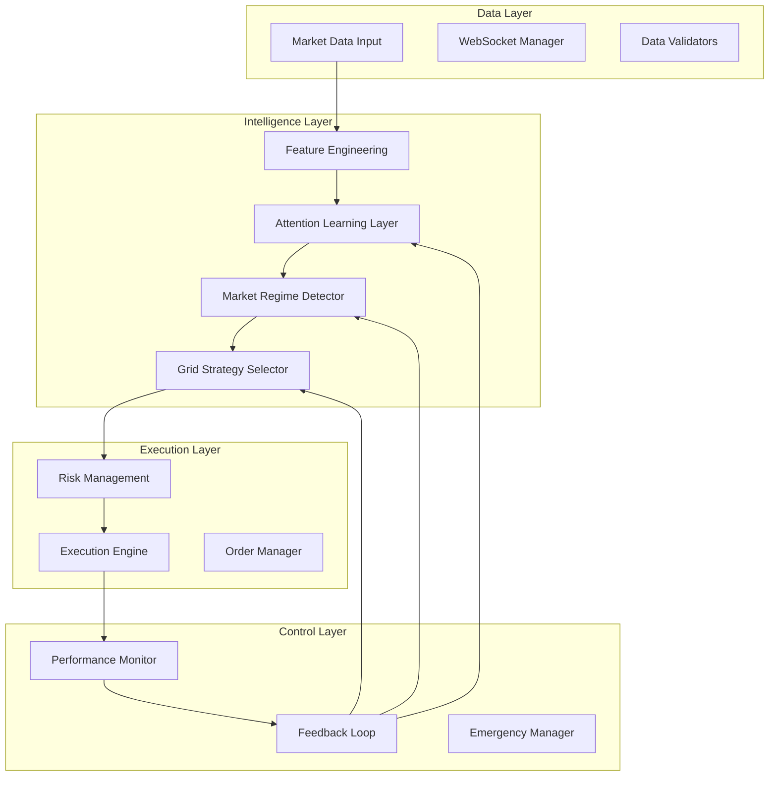

### 1.2 Module Categories

| Layer | Modules | Purpose | Latency Budget |
|-------|---------|---------|----------------|
| **Data Layer** | Market Data Input, WebSocket Manager | รับและ validate ข้อมูลตลาด | 500μs |
| **Intelligence Layer** | Feature Engineering, Attention System, Regime Detector | วิเคราะห์และตัดสินใจ | 2ms |
| **Execution Layer** | Risk Management, Execution Engine | จัดการคำสั่งซื้อขาย | 1.5ms |
| **Control Layer** | Performance Monitor, Feedback Loop | ติดตามและปรับปรุง | Async |

---

## 2. Module Details และการทำงาน

### 2.1 Market Data Input Module

```python
class MarketDataInput:
    """
    หน้าที่: รับข้อมูลตลาดแบบ real-time
    Input: Raw market data จาก exchanges
    Output: Validated MarketTick objects
    """
```

#### Workflow:
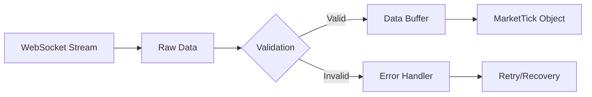

#### Key Components:
- **WebSocket Manager**: จัดการ connection pooling
- **Data Validators**: ตรวจสอบ price, volume, timestamp
- **Circular Buffer**: เก็บข้อมูล 1000 ticks ล่าสุด
- **Anomaly Detector**: ตรวจจับข้อมูลผิดปกติ

#### Performance Specs:
- Latency: < 500μs per tick
- Throughput: > 1000 ticks/second
- Memory: ~50MB for buffer

### 2.2 Feature Engineering Pipeline

```python
class FeatureEngineeringPipeline:
    """
    หน้าที่: แปลงข้อมูลดิบเป็น features
    Input: Market data buffer
    Output: Feature dictionary (10-20 features)
    """
```

#### Feature Categories:

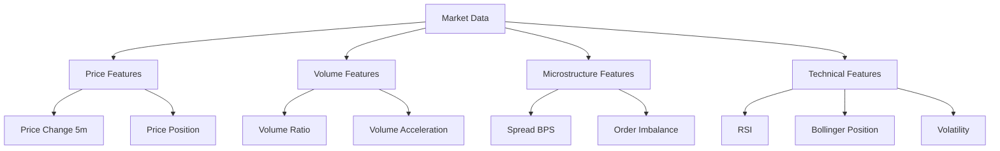

#### Feature Extraction Flow:
1. **Cache Check** (50μs)
2. **Parallel Extraction** (500μs)
3. **Quality Scoring** (100μs)
4. **Attention Tracking** (50μs)

### 2.3 Attention Learning Layer

```python
class AttentionLearningLayer:
    """
    หน้าที่: Progressive learning system
    3 Phases: Learning -> Shadow -> Active
    """
```

#### Three-Phase Architecture:

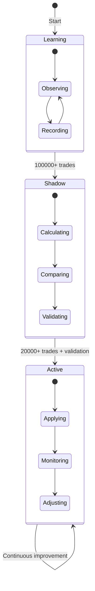

#### Sub-modules:

##### 2.3.1 Feature Attention
```python
# ปรับน้ำหนักของ features ตามความสำคัญ
feature_importance = {
    'volatility_5m': 0.85,      # High importance
    'price_change_5m': 0.75,
    'volume_ratio': 0.60,
    'spread_bps': 0.40          # Lower importance
}
```

##### 2.3.2 Temporal Attention
```python
# ให้น้ำหนักข้อมูลตามเวลา
temporal_weights = {
    'short_term': 0.5,   # Last 20 ticks
    'medium_term': 0.3,  # Last 100 ticks
    'long_term': 0.2     # Last 500 ticks
}
```

##### 2.3.3 Regime Attention
```python
# ปรับ parameters ตาม market regime
regime_adjustments = {
    'RANGING': {'spacing': 1.0, 'levels': 1.2},
    'TRENDING': {'spacing': 1.5, 'levels': 0.8},
    'VOLATILE': {'spacing': 2.0, 'levels': 0.5}
}
```

### 2.4 Market Regime Detector

```python
class MarketRegimeDetector:
    """
    หน้าที่: ระบุสภาวะตลาดปัจจุบัน
    Output: RANGING, TRENDING, VOLATILE, DORMANT
    """
```

#### Detection Rules:

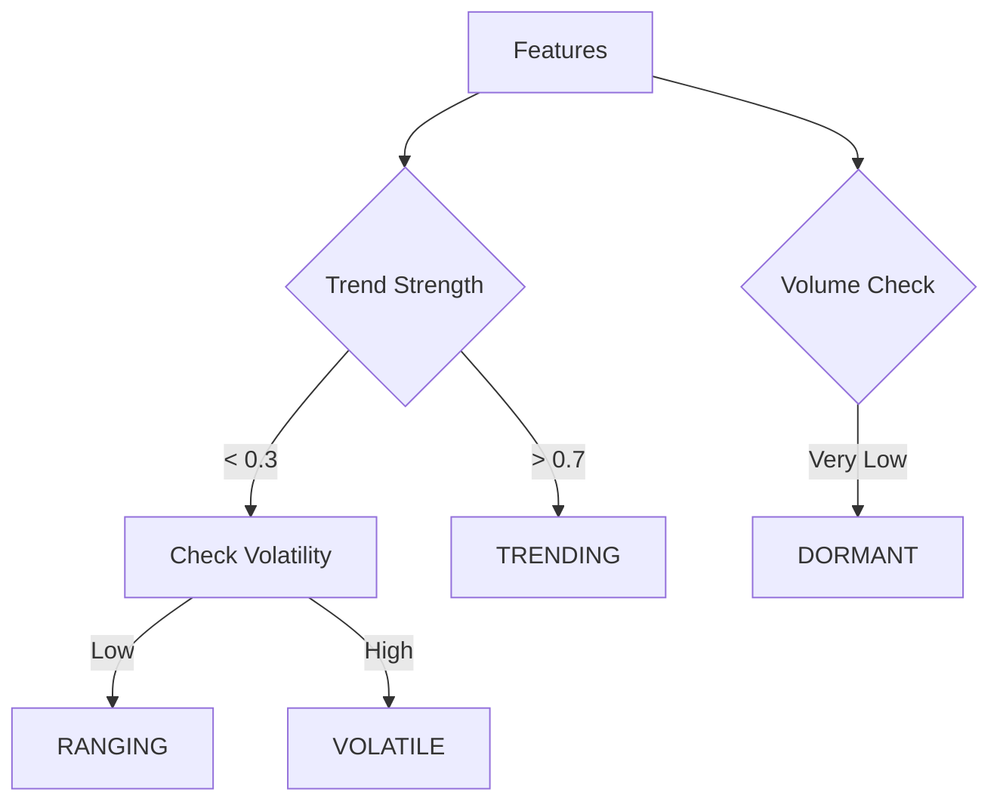

#### Regime Characteristics:

| Regime | Trend | Volatility | Volume | Strategy |
|--------|-------|------------|---------|----------|
| RANGING | Low | Low-Med | Normal | Tight grids |
| TRENDING | High | Medium | High | Asymmetric grids |
| VOLATILE | Any | High | High | Wide grids |
| DORMANT | None | Very Low | Very Low | Minimal/No trading |

### 2.5 Grid Strategy Selector

```python
class GridStrategySelector:
    """
    หน้าที่: เลือก strategy ที่เหมาะสมตาม regime
    Output: GridStrategyConfig
    """
```

#### Strategy Selection Matrix:

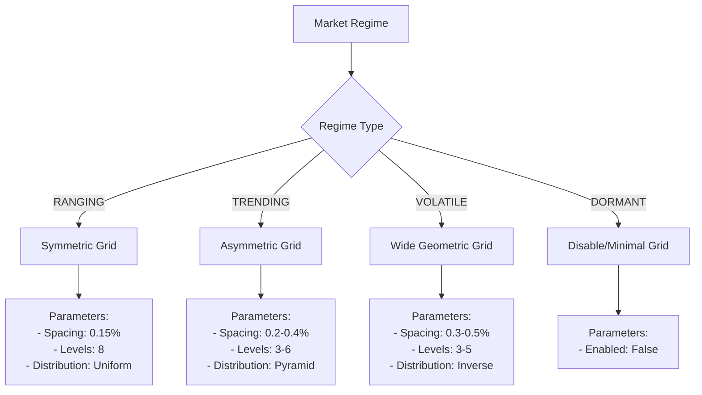

### 2.6 Risk Management System

```python
class RiskManagementSystem:
    """
    หน้าที่: ควบคุมความเสี่ยงทุกระดับ
    Components: Position Tracker, Risk Calculator, Circuit Breaker
    """
```

#### Risk Control Flow:

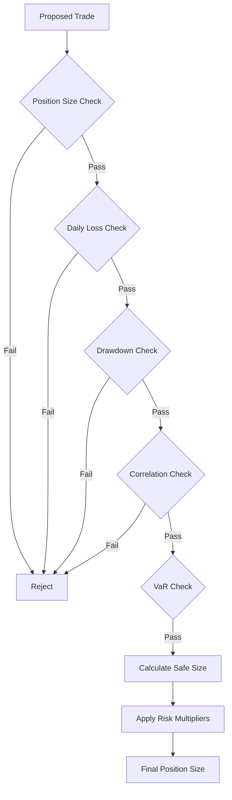

#### Risk Limits:
```python
RISK_LIMITS = {
    'max_position_size': 0.05,      # 5% per position
    'max_concurrent_orders': 8,     # Max 8 orders
    'max_daily_loss': 0.01,         # 1% daily
    'max_drawdown': 0.03,           # 3% total
    'position_correlation': 0.7,     # Max correlation
    'concentration_limit': 0.2       # 20% in one asset
}
```

### 2.7 Execution Engine

```python
class ExecutionEngine:
    """
    หน้าที่: Execute orders with optimization
    Features: Fee optimization, Order validation, Smart routing
    """
```

#### Execution Pipeline:

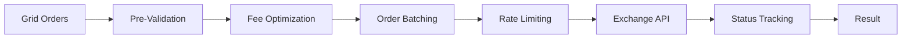

#### Execution Strategies:
1. **Passive**: Post-only orders สำหรับ maker fees
2. **Aggressive**: IOC orders สำหรับความเร็ว
3. **Smart**: เลือกตามสภาพ spread

### 2.8 Performance Monitor

```python
class PerformanceMonitor:
    """
    หน้าที่: Track และ analyze performance
    Metrics: Trading, System, Attention
    """
```

#### Monitoring Dashboard:

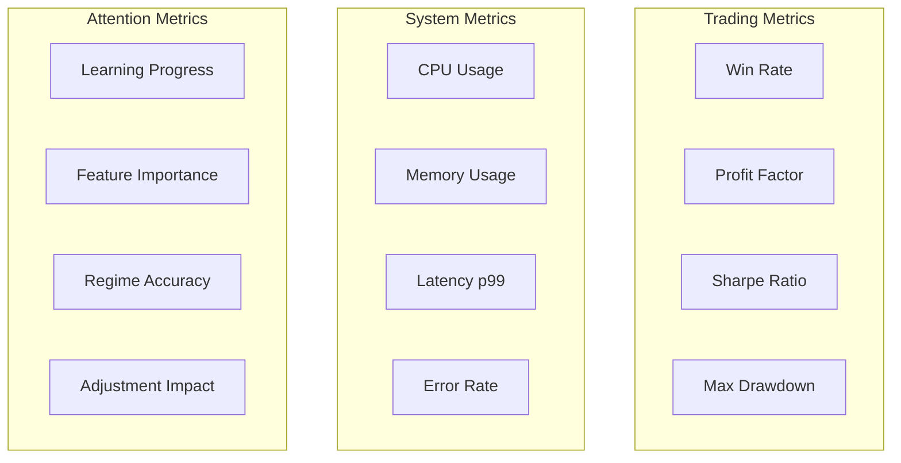

### 2.9 Feedback Loop

```python
class FeedbackLoop:
    """
    หน้าที่: Continuous improvement
    Updates: Attention weights, Strategy params, Risk limits
    """
```

#### Feedback Flow:

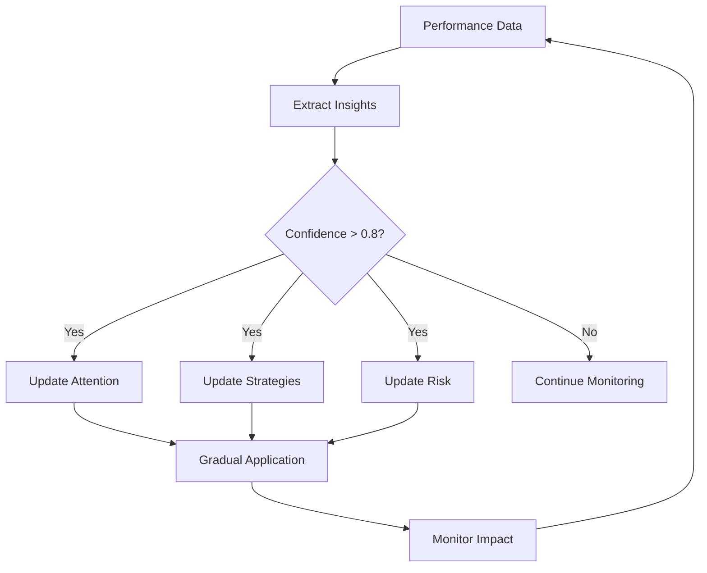

---

## 3. Data Flow Architecture

### 3.1 Complete Data Flow

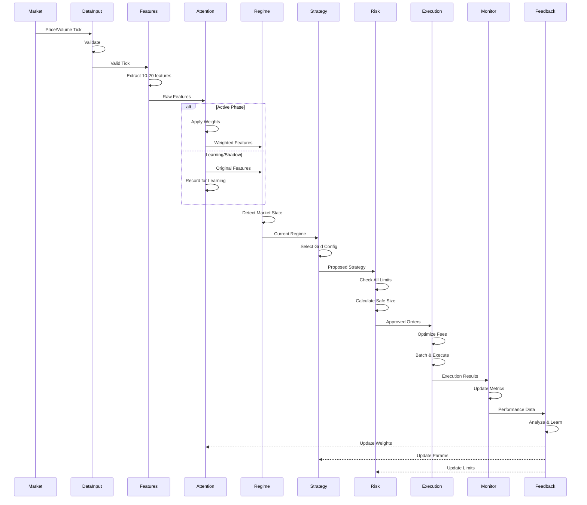

### 3.2 Latency Breakdown

```mermaid
gantt
    title Execution Loop Latency (Target: 5ms)
    dateFormat X
    axisFormat %L
    
    section Data Layer
    Market Data Input    :0, 500
    
    section Intelligence
    Feature Engineering  :500, 1000
    Attention Processing :1500, 500
    Regime Detection     :2000, 500
    Strategy Selection   :2500, 500
    
    section Execution
    Risk Management      :3000, 500
    Order Execution      :3500, 1000
    
    section Total
    Complete Loop        :0, 4500
```

---

## 4. Attention System Workflow

### 4.1 Progressive Learning Phases

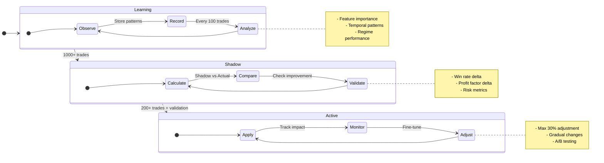

### 4.2 Attention Weight Calculation

```python
# Feature Attention Example
def calculate_feature_weights(features, history):
    """
    คำนวณน้ำหนักของแต่ละ feature
    """
    weights = {}
    
    for feature_name, value in features.items():
        # 1. Variance score (ความผันผวน)
        variance = calculate_variance(history[feature_name])
        
        # 2. Correlation with profit
        correlation = calculate_profit_correlation(feature_name)
        
        # 3. Extraction speed
        speed_score = 1 / extraction_time[feature_name]
        
        # Combined weight
        weights[feature_name] = (
            0.4 * variance +
            0.4 * correlation +
            0.2 * speed_score
        )
    
    return normalize_weights(weights)
```

---

## 5. Trading Execution Flow

### 5.1 Grid Order Creation

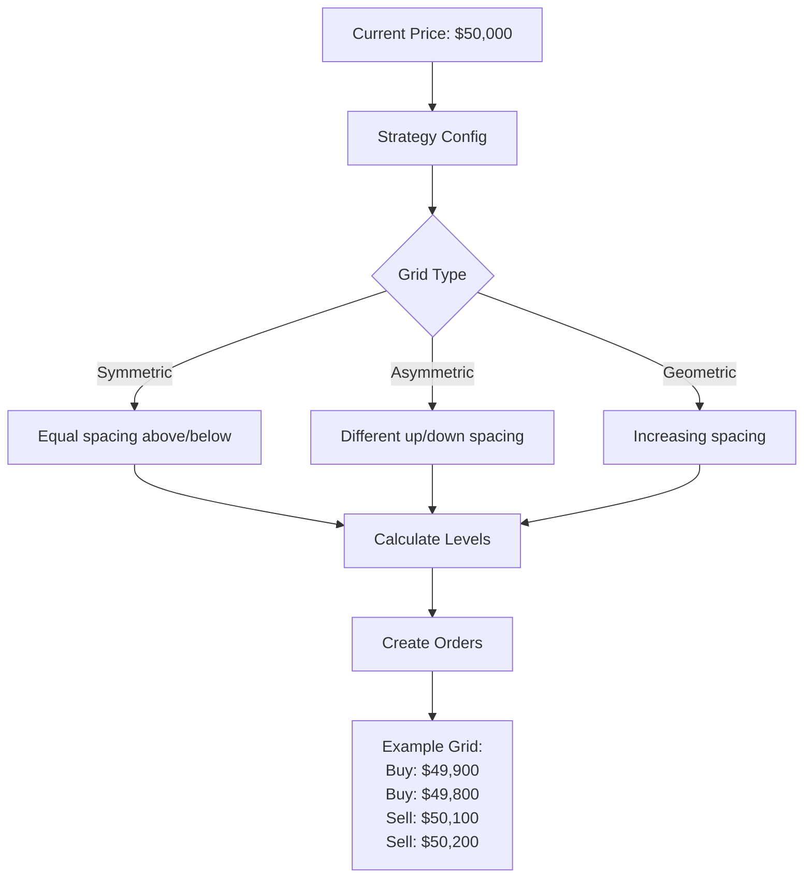

### 5.2 Order Lifecycle

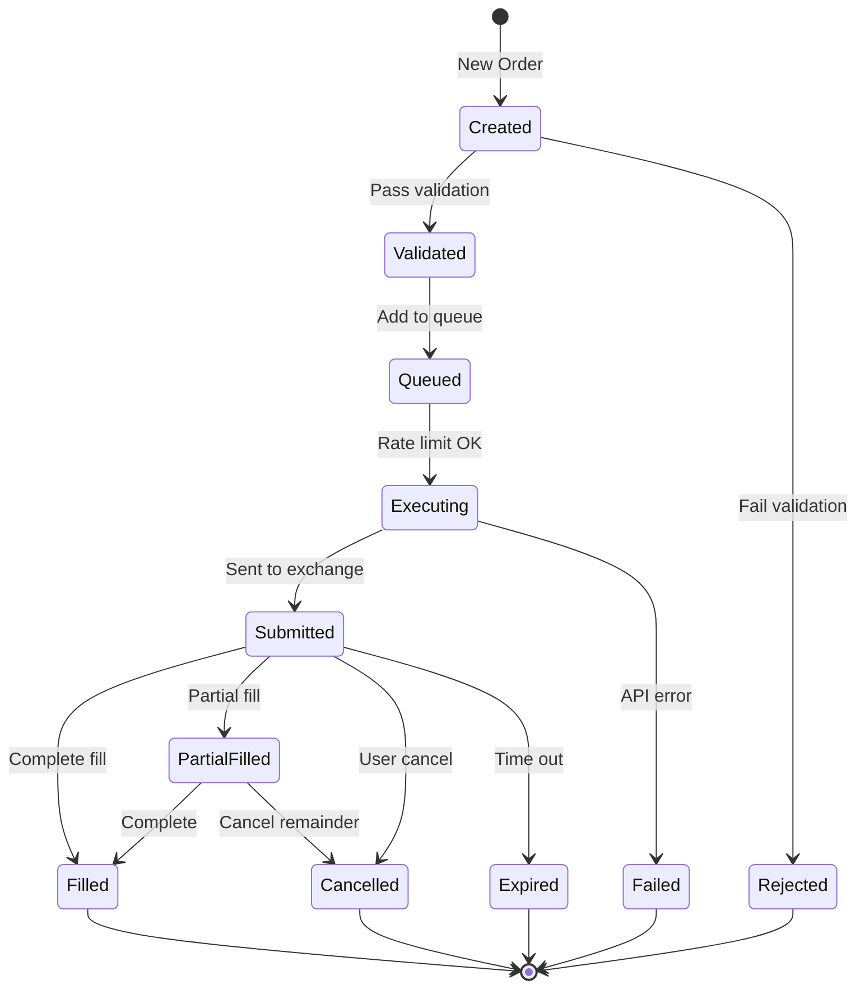

---

## 6. Module Interactions

### 6.1 Critical Interactions

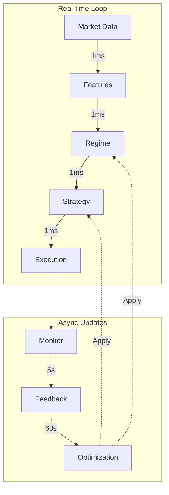

### 6.2 Module Dependencies

| Module | Depends On | Used By |
|--------|-----------|---------|
| Market Data | WebSocket | Features, Monitor |
| Features | Market Data | Attention, Regime |
| Attention | Features | Regime, Strategy |
| Regime | Features/Attention | Strategy |
| Strategy | Regime | Risk, Execution |
| Risk | Strategy, Positions | Execution |
| Execution | Risk | Monitor |
| Monitor | All modules | Feedback |
| Feedback | Monitor | All modules |

---

## 7. Performance Optimization

### 7.1 Optimization Strategies

#### Data Structure Optimization
```python
# Bad: List of dictionaries
ticks = [
    {'price': 50000, 'volume': 100},
    {'price': 50001, 'volume': 101}
]

# Good: NumPy arrays
prices = np.array([50000, 50001])
volumes = np.array([100, 101])
```

#### Caching Strategy
```python
class FeatureCache:
    def __init__(self, ttl=60):
        self.cache = {}
        self.timestamps = {}
        
    def get(self, key):
        if key in self.cache:
            if time.time() - self.timestamps[key] < self.ttl:
                return self.cache[key]
        return None
```

#### Parallel Processing
```python
# Feature extraction in parallel
async def extract_features_parallel(data):
    tasks = [
        extract_price_features(data),
        extract_volume_features(data),
        extract_technical_features(data)
    ]
    results = await asyncio.gather(*tasks)
    return merge_results(results)
```

### 7.2 Memory Management

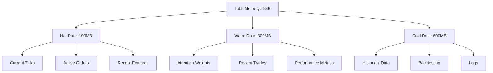

---

## 8. Error Handling และ Recovery

### 8.1 Error Hierarchy

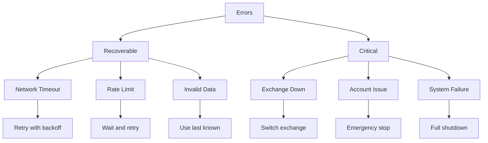

### 8.2 Recovery Procedures

#### Module-Specific Recovery

| Module | Failure Type | Recovery Action |
|--------|-------------|-----------------|
| Market Data | Connection lost | Reconnect, use cache |
| Features | Calculation error | Use defaults |
| Attention | Invalid weights | Disable temporarily |
| Regime | Detection failure | Use last known |
| Strategy | Invalid config | Use conservative |
| Risk | Limit breach | Block trading |
| Execution | API error | Retry queue |
| Monitor | Metric failure | Continue, log error |

#### System Recovery Flow

```python
async def recover_from_crash():
    """System recovery procedure"""
    
    # 1. Load last known state
    state = load_checkpoint()
    
    # 2. Verify positions
    positions = await verify_exchange_positions()
    
    # 3. Sync state
    await sync_internal_state(positions)
    
    # 4. Start in safe mode
    config = get_safe_mode_config()
    
    # 5. Gradual activation
    await start_system(config, recovery_mode=True)
    
    # 6. Monitor closely
    await enhanced_monitoring(duration=3600)
```

---

## Summary

### Key Design Principles

1. **Modularity**: แต่ละ module ทำหน้าที่เฉพาะ
2. **Low Latency**: Total loop < 5ms
3. **Progressive Learning**: เรียนรู้ก่อนใช้งาน
4. **Fault Tolerance**: ทุก module มี fallback
5. **Risk First**: Risk management มาก่อนเสมอ

### Critical Success Factors

- ✅ **Data Quality**: Validation ที่ดี
- ✅ **Low Latency**: Optimized code paths
- ✅ **Risk Control**: Multiple safety layers
- ✅ **Monitoring**: Real-time visibility
- ✅ **Recovery**: Graceful degradation

### Performance Targets

```yaml
Latency:
  - Data Input: < 500μs
  - Features: < 1ms
  - Decision: < 2ms
  - Execution: < 1.5ms
  - Total: < 5ms

Reliability:
  - Uptime: > 99.9%
  - Error Rate: < 0.1%
  - Fill Rate: > 95%

Efficiency:
  - CPU: < 50%
  - Memory: < 1GB
  - Network: < 10Mbps
```

---

**Version**: 1.0.0  
**Architecture Date**: January 2024  
**Next Review**: April 2024