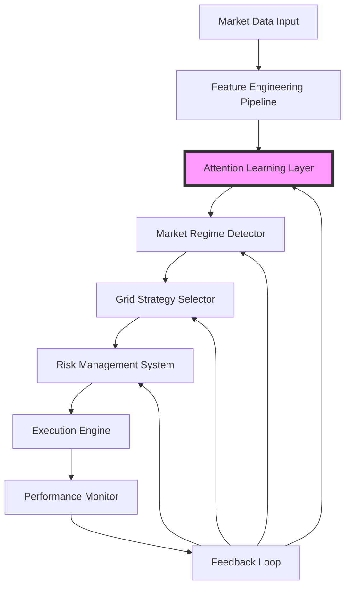

# Grid Trading System with Progressive Attention Architecture - Complete Implementation Guide

## Table of Contents
1. [System Overview](#system-overview)
2. [Architecture Design](#architecture-design)
3. [Component Details](#component-details)
4. [Implementation Pipeline](#implementation-pipeline)
5. [Performance Optimization](#performance-optimization)
6. [Coding Standards](#coding-standards)
7. [Testing Strategy](#testing-strategy)
8. [Deployment Guide](#deployment-guide)
9. [Monitoring & Maintenance](#monitoring--maintenance)
10. [Troubleshooting](#troubleshooting)

---

## 1. System Overview

### 1.1 Purpose and Goals
The Grid Trading System with Progressive Attention Architecture is designed to:
- Execute grid trading strategies on 5-minute crypto timeframes
- Learn optimal trading patterns through observation (1000+ trades)
- Progressively activate attention mechanisms for improved performance
- Maintain sub-5ms execution latency while adding intelligence

### 1.2 Key Principles
```
1. Simple: Core logic remains straightforward
2. Fast: <5ms total execution loop
3. Robust: Multiple failsafes and fallback mechanisms
4. Progressive: Learn → Shadow → Active phases
```

### 1.3 System Flow


---

## 2. Architecture Design

### 2.1 System Architecture Layers

```python
# Layer Structure
SYSTEM_LAYERS = {
    'data_layer': {
        'components': ['WebSocket Manager', 'Data Buffer', 'Validator'],
        'latency_budget': '500μs',
        'memory_limit': '100MB'
    },
    'processing_layer': {
        'components': ['Feature Engine', 'Regime Detector', 'Strategy Selector'],
        'latency_budget': '2ms',
        'memory_limit': '200MB'
    },
    'attention_layer': {
        'components': ['Feature Attention', 'Temporal Attention', 'Regime Attention'],
        'latency_budget': '1ms',
        'memory_limit': '500MB'
    },
    'execution_layer': {
        'components': ['Risk Manager', 'Order Manager', 'Position Tracker'],
        'latency_budget': '1ms',
        'memory_limit': '50MB'
    },
    'monitoring_layer': {
        'components': ['Performance Monitor', 'Alert System', 'Logger'],
        'latency_budget': 'async',
        'memory_limit': '100MB'
    }
}
```

### 2.2 Data Flow Architecture

```python
class DataFlowArchitecture:
    """
    Defines how data flows through the system
    """
    
    def __init__(self):
        self.flow_stages = [
            'raw_market_data',
            'validated_data',
            'engineered_features',
            'attention_processed_features',
            'regime_classification',
            'strategy_selection',
            'risk_adjusted_params',
            'execution_orders',
            'performance_metrics',
            'feedback_signals'
        ]
        
    def get_stage_requirements(self, stage):
        """Define requirements for each stage"""
        requirements = {
            'raw_market_data': {
                'format': 'JSON/Binary',
                'frequency': 'tick/100ms',
                'validation': 'schema_check'
            },
            'engineered_features': {
                'format': 'numpy.array',
                'size': '10-20 features',
                'normalization': 'required'
            },
            'execution_orders': {
                'format': 'Order objects',
                'validation': 'risk_check',
                'latency': '<1ms'
            }
        }
        return requirements.get(stage, {})
```

### 2.3 Memory Architecture

```python
# Memory Layout Design
MEMORY_ARCHITECTURE = {
    'hot_data': {
        'storage': 'RAM',
        'access_pattern': 'sequential',
        'size': '~50MB',
        'contents': [
            'current_features',
            'active_orders',
            'recent_trades'
        ]
    },
    'warm_data': {
        'storage': 'Redis',
        'access_pattern': 'random',
        'size': '~500MB',
        'contents': [
            'attention_weights',
            'regime_history',
            'performance_metrics'
        ]
    },
    'cold_data': {
        'storage': 'PostgreSQL',
        'access_pattern': 'batch',
        'size': 'unlimited',
        'contents': [
            'historical_trades',
            'backtesting_data',
            'model_checkpoints'
        ]
    }
}
```

---

## 3. Component Details

### 3.1 Market Data Input Component

```python
class MarketDataInput:
    """
    Handles all incoming market data with attention tracking
    """
    
    def __init__(self, config):
        self.config = config
        self.websocket_manager = WebSocketManager()
        self.data_buffer = CircularBuffer(size=1000)
        self.attention_store = AttentionDataStore()
        self.validators = self._init_validators()
        
    def _init_validators(self):
        """Initialize data validators"""
        return {
            'price': PriceValidator(min_val=0, max_change=0.1),
            'volume': VolumeValidator(min_val=0),
            'timestamp': TimestampValidator(max_delay=1000)  # ms
        }
        
    async def collect_tick(self):
        """Collect and validate single tick"""
        try:
            # Get raw data
            raw_data = await self.websocket_manager.get_tick()
            
            # Validate
            validated_data = self._validate_tick(raw_data)
            
            # Store for attention learning
            self.attention_store.add_tick(validated_data)
            
            # Add to buffer
            self.data_buffer.append(validated_data)
            
            return validated_data
            
        except ValidationError as e:
            logger.warning(f"Data validation failed: {e}")
            return None
            
    def _validate_tick(self, raw_data):
        """Validate tick data"""
        validated = {}
        
        for field, validator in self.validators.items():
            if field in raw_data:
                validated[field] = validator.validate(raw_data[field])
                
        # Add metadata for attention
        validated['_metadata'] = {
            'source': raw_data.get('exchange'),
            'latency': time.time() - raw_data.get('timestamp', time.time()),
            'quality_score': self._calculate_quality_score(raw_data)
        }
        
        return validated
```

### 3.2 Feature Engineering Pipeline

```python
class FeatureEngineeringPipeline:
    """
    Extract features with attention tracking
    """
    
    def __init__(self):
        self.feature_extractors = self._init_extractors()
        self.feature_cache = FeatureCache()
        self.attention_tracker = FeatureAttentionTracker()
        
    def _init_extractors(self):
        """Initialize feature extractors"""
        return {
            # Price features
            'price_change_5m': PriceChangeExtractor(period=5),
            'price_position': PricePositionExtractor(),
            
            # Volume features
            'volume_ratio': VolumeRatioExtractor(),
            'volume_acceleration': VolumeAccelerationExtractor(),
            
            # Microstructure features
            'spread_bps': SpreadExtractor(),
            'order_imbalance': OrderImbalanceExtractor(),
            
            # Technical features
            'rsi_14': RSIExtractor(period=14),
            'bb_position': BollingerBandExtractor(),
            
            # Market state features
            'volatility_5m': VolatilityExtractor(period=5),
            'trend_strength': TrendStrengthExtractor()
        }
        
    def extract_features(self, market_data):
        """Extract all features with caching"""
        
        # Check cache first
        cache_key = self._generate_cache_key(market_data)
        if self.feature_cache.exists(cache_key):
            return self.feature_cache.get(cache_key)
            
        # Extract features
        features = {}
        extraction_times = {}
        
        for name, extractor in self.feature_extractors.items():
            start_time = time.perf_counter()
            
            try:
                features[name] = extractor.extract(market_data)
            except Exception as e:
                logger.error(f"Feature extraction failed for {name}: {e}")
                features[name] = extractor.get_default_value()
                
            extraction_times[name] = time.perf_counter() - start_time
            
        # Track for attention learning
        self.attention_tracker.record(features, extraction_times)
        
        # Cache results
        self.feature_cache.set(cache_key, features)
        
        return features
```

### 3.3 Attention Learning Layer

```python
class AttentionLearningLayer:
    """
    Master attention controller with three sub-modules
    """
    
    def __init__(self, config):
        self.config = config
        self.phase = AttentionPhase.LEARNING
        
        # Initialize attention modules
        self.feature_attention = FeatureAttention()
        self.temporal_attention = TemporalAttention()
        self.regime_attention = RegimeAttention()
        
        # Learning metrics
        self.metrics = AttentionMetrics()
        self.phase_controller = PhaseController()
        
    async def process(self, features, regime, context):
        """Process features through attention based on current phase"""
        
        # Record processing start
        start_time = time.perf_counter()
        
        # Phase-based processing
        if self.phase == AttentionPhase.LEARNING:
            output = await self._learning_phase(features, regime, context)
            
        elif self.phase == AttentionPhase.SHADOW:
            output = await self._shadow_phase(features, regime, context)
            
        elif self.phase == AttentionPhase.ACTIVE:
            output = await self._active_phase(features, regime, context)
            
        # Record metrics
        self.metrics.record_processing_time(time.perf_counter() - start_time)
        
        # Check for phase transition
        if self.phase_controller.should_transition(self.metrics):
            await self._transition_phase()
            
        return output
        
    async def _learning_phase(self, features, regime, context):
        """Learning phase: observe only"""
        
        # Let each module observe
        self.feature_attention.observe(features, context)
        self.temporal_attention.observe(context['history'], context['timestamp'])
        self.regime_attention.observe(regime, context['strategy_params'])
        
        # Return unchanged features
        return features
        
    async def _shadow_phase(self, features, regime, context):
        """Shadow phase: calculate but don't apply"""
        
        # Calculate attention weights
        feature_weights = self.feature_attention.calculate_weights(features)
        temporal_weights = self.temporal_attention.calculate_weights(context['history'])
        regime_adjustments = self.regime_attention.calculate_adjustments(regime)
        
        # Log for comparison
        self.metrics.record_shadow_calculation({
            'feature_weights': feature_weights,
            'temporal_weights': temporal_weights,
            'regime_adjustments': regime_adjustments
        })
        
        # Still return unchanged features
        return features
        
    async def _active_phase(self, features, regime, context):
        """Active phase: apply attention"""
        
        # Apply feature attention
        weighted_features = self.feature_attention.apply_weights(features)
        
        # Apply temporal attention to historical context
        weighted_history = self.temporal_attention.apply_weights(context['history'])
        
        # Get regime-specific adjustments
        regime_params = self.regime_attention.apply_adjustments(
            regime, context['strategy_params']
        )
        
        # Update context with adjustments
        context['weighted_history'] = weighted_history
        context['adjusted_params'] = regime_params
        
        return weighted_features
```

### 3.4 Market Regime Detector

```python
class MarketRegimeDetector:
    """
    Detect market regime with attention enhancement
    """
    
    def __init__(self, attention_layer):
        self.attention = attention_layer
        self.regime_rules = self._init_regime_rules()
        self.regime_history = deque(maxlen=100)
        self.transition_detector = RegimeTransitionDetector()
        
    def _init_regime_rules(self):
        """Initialize regime detection rules"""
        return {
            'RANGING': RangingRegimeRule(),
            'TRENDING': TrendingRegimeRule(),
            'VOLATILE': VolatileRegimeRule(),
            'DORMANT': DormantRegimeRule()
        }
        
    def detect_regime(self, features):
        """Detect current market regime"""
        
        # Apply attention if active
        if self.attention.phase == AttentionPhase.ACTIVE:
            features = self.attention.process_features_for_regime(features)
            
        # Calculate regime scores
        regime_scores = {}
        
        for regime_name, rule in self.regime_rules.items():
            score = rule.calculate_score(features)
            regime_scores[regime_name] = score
            
        # Select regime with highest score
        current_regime = max(regime_scores, key=regime_scores.get)
        confidence = regime_scores[current_regime]
        
        # Check for transition
        if self.regime_history:
            transition = self.transition_detector.check_transition(
                self.regime_history[-1], current_regime, confidence
            )
            if transition:
                self._handle_transition(transition)
                
        # Update history
        self.regime_history.append({
            'regime': current_regime,
            'confidence': confidence,
            'timestamp': time.time(),
            'features': features.copy()
        })
        
        return current_regime, confidence
```

### 3.5 Grid Strategy Selector

```python
class GridStrategySelector:
    """
    Select and configure grid strategy based on regime
    """
    
    def __init__(self, attention_layer):
        self.attention = attention_layer
        self.strategies = self._init_strategies()
        self.strategy_cache = StrategyCache()
        
    def _init_strategies(self):
        """Initialize regime-specific strategies"""
        return {
            'RANGING': RangingGridStrategy(),
            'TRENDING': TrendingGridStrategy(),
            'VOLATILE': VolatileGridStrategy(),
            'DORMANT': DormantStrategy()
        }
        
    def select_strategy(self, regime, features, context):
        """Select appropriate grid strategy"""
        
        # Get base strategy
        base_strategy = self.strategies[regime]
        
        # Check cache
        cache_key = f"{regime}:{hash(str(features))}"
        if self.strategy_cache.exists(cache_key):
            return self.strategy_cache.get(cache_key)
            
        # Configure strategy parameters
        params = base_strategy.get_base_parameters()
        
        # Apply attention adjustments if active
        if self.attention.phase == AttentionPhase.ACTIVE:
            params = self.attention.adjust_strategy_params(params, regime, context)
            
        # Dynamic adjustments based on current conditions
        params = self._apply_dynamic_adjustments(params, features, context)
        
        # Create final strategy configuration
        strategy_config = GridStrategyConfig(
            regime=regime,
            params=params,
            risk_limits=self._calculate_risk_limits(params, context),
            execution_rules=self._get_execution_rules(regime)
        )
        
        # Cache configuration
        self.strategy_cache.set(cache_key, strategy_config, ttl=60)
        
        return strategy_config
        
    def _apply_dynamic_adjustments(self, params, features, context):
        """Apply real-time adjustments to parameters"""
        
        adjusted_params = params.copy()
        
        # Volatility adjustment
        current_vol = features.get('volatility_5m', 0.001)
        vol_multiplier = current_vol / 0.001  # baseline
        adjusted_params['spacing'] *= vol_multiplier
        
        # Spread adjustment
        spread_bps = features.get('spread_bps', 1)
        if spread_bps > 5:
            adjusted_params['spacing'] *= 1.5
            adjusted_params['levels'] = max(4, params['levels'] - 2)
            
        # Volume adjustment
        volume_ratio = features.get('volume_ratio', 1.0)
        if volume_ratio < 0.3:
            adjusted_params['enabled'] = False  # Disable in low volume
            
        return adjusted_params
```

### 3.6 Risk Management System

```python
class RiskManagementSystem:
    """
    Comprehensive risk management with attention insights
    """
    
    def __init__(self, config, attention_layer):
        self.config = config
        self.attention = attention_layer
        self.risk_calculator = RiskCalculator()
        self.position_tracker = PositionTracker()
        self.risk_limits = self._init_risk_limits()
        
    def _init_risk_limits(self):
        """Initialize risk limits"""
        return {
            'max_position_size': 0.2,  # 20% of capital
            'max_concurrent_orders': 12,
            'max_daily_loss': 0.02,  # 2%
            'max_drawdown': 0.05,  # 5%
            'position_correlation_limit': 0.8,
            'concentration_limit': 0.3  # 30% in single asset
        }
        
    def calculate_position_size(self, strategy_config, context):
        """Calculate safe position size"""
        
        # Base position size
        base_size = self._calculate_base_size(strategy_config)
        
        # Risk adjustments
        risk_multipliers = {
            'volatility': self._get_volatility_multiplier(context),
            'drawdown': self._get_drawdown_multiplier(),
            'correlation': self._get_correlation_multiplier(context),
            'regime': self._get_regime_risk_multiplier(strategy_config.regime)
        }
        
        # Apply attention insights if active
        if self.attention.phase == AttentionPhase.ACTIVE:
            risk_multipliers['attention'] = self.attention.get_risk_adjustment()
            
        # Calculate final multiplier
        total_multiplier = 1.0
        for factor, multiplier in risk_multipliers.items():
            total_multiplier *= multiplier
            
        # Apply to base size
        final_size = base_size * total_multiplier
        
        # Ensure within limits
        final_size = self._apply_position_limits(final_size, context)
        
        return final_size
        
    def check_risk_limits(self, proposed_action):
        """Check if action violates risk limits"""
        
        violations = []
        
        # Position size check
        if proposed_action['size'] > self.risk_limits['max_position_size']:
            violations.append('position_size_exceeded')
            
        # Daily loss check
        current_daily_loss = self.position_tracker.get_daily_loss()
        if current_daily_loss > self.risk_limits['max_daily_loss']:
            violations.append('daily_loss_exceeded')
            
        # Drawdown check
        current_drawdown = self.position_tracker.get_current_drawdown()
        if current_drawdown > self.risk_limits['max_drawdown']:
            violations.append('max_drawdown_exceeded')
            
        return violations
```

### 3.7 Execution Engine

```python
class ExecutionEngine:
    """
    High-performance order execution
    """
    
    def __init__(self, exchange_configs):
        self.exchange_manager = ExchangeManager(exchange_configs)
        self.order_manager = OrderManager()
        self.execution_queue = asyncio.Queue()
        self.active_orders = {}
        
    async def execute_grid_strategy(self, strategy_config, risk_params):
        """Execute grid trading strategy"""
        
        try:
            # Prepare grid orders
            grid_orders = self._prepare_grid_orders(strategy_config, risk_params)
            
            # Pre-validate all orders
            validated_orders = await self._validate_orders(grid_orders)
            
            # Batch execution
            execution_results = await self._batch_execute(validated_orders)
            
            # Track active orders
            for order, result in zip(validated_orders, execution_results):
                if result['status'] == 'success':
                    self.active_orders[result['order_id']] = order
                    
            return execution_results
            
        except ExecutionError as e:
            logger.error(f"Execution failed: {e}")
            await self._handle_execution_failure(e)
            raise
            
    def _prepare_grid_orders(self, strategy_config, risk_params):
        """Prepare grid orders for execution"""
        
        orders = []
        current_price = self.exchange_manager.get_current_price(strategy_config.symbol)
        
        # Calculate grid levels
        grid_levels = self._calculate_grid_levels(
            current_price,
            strategy_config.params['spacing'],
            strategy_config.params['levels']
        )
        
        # Create orders for each level
        for i, level in enumerate(grid_levels):
            order = GridOrder(
                symbol=strategy_config.symbol,
                side='buy' if level < current_price else 'sell',
                price=level,
                size=risk_params['position_size'] / len(grid_levels),
                order_type='limit',
                time_in_force='GTC',
                metadata={
                    'grid_id': f"{strategy_config.regime}_{i}",
                    'strategy': strategy_config.regime,
                    'level_index': i
                }
            )
            orders.append(order)
            
        return orders
        
    async def _batch_execute(self, orders):
        """Execute orders in optimized batches"""
        
        # Group by exchange
        exchange_groups = defaultdict(list)
        for order in orders:
            exchange_groups[order.exchange].append(order)
            
        # Execute in parallel per exchange
        tasks = []
        for exchange, exchange_orders in exchange_groups.items():
            task = self._execute_on_exchange(exchange, exchange_orders)
            tasks.append(task)
            
        results = await asyncio.gather(*tasks)
        
        # Flatten results
        all_results = []
        for exchange_results in results:
            all_results.extend(exchange_results)
            
        return all_results
```

### 3.8 Performance Monitor

```python
class PerformanceMonitor:
    """
    Monitor system and trading performance
    """
    
    def __init__(self, attention_layer):
        self.attention = attention_layer
        self.metrics_store = MetricsStore()
        self.alert_manager = AlertManager()
        self.dashboard_server = DashboardServer()
        
    async def update_metrics(self, trade_result, context):
        """Update all performance metrics"""
        
        # Trading metrics
        trading_metrics = self._calculate_trading_metrics(trade_result)
        
        # System metrics
        system_metrics = self._calculate_system_metrics()
        
        # Attention metrics (if active)
        attention_metrics = None
        if self.attention.phase != AttentionPhase.LEARNING:
            attention_metrics = self._calculate_attention_metrics()
            
        # Store all metrics
        await self.metrics_store.store({
            'timestamp': time.time(),
            'trading': trading_metrics,
            'system': system_metrics,
            'attention': attention_metrics
        })
        
        # Check for alerts
        alerts = self._check_alert_conditions(trading_metrics, system_metrics)
        if alerts:
            await self.alert_manager.send_alerts(alerts)
            
        # Update dashboard
        await self.dashboard_server.update({
            'trading': trading_metrics,
            'system': system_metrics,
            'attention': attention_metrics,
            'alerts': alerts
        })
        
    def _calculate_trading_metrics(self, trade_result):
        """Calculate trading performance metrics"""
        
        return {
            'total_trades': self.metrics_store.get_total_trades(),
            'win_rate': self._calculate_win_rate(),
            'profit_factor': self._calculate_profit_factor(),
            'sharpe_ratio': self._calculate_sharpe_ratio(),
            'max_drawdown': self._calculate_max_drawdown(),
            'grid_fill_rate': self._calculate_grid_fill_rate(),
            'avg_profit_per_grid': self._calculate_avg_profit_per_grid()
        }
        
    def _calculate_attention_metrics(self):
        """Calculate attention system metrics"""
        
        return {
            'phase': self.attention.phase.value,
            'learning_progress': self.attention.get_learning_progress(),
            'feature_importance': self.attention.feature_attention.get_importance_scores(),
            'temporal_patterns': self.attention.temporal_attention.get_patterns(),
            'regime_performance': self.attention.regime_attention.get_performance_by_regime()
        }
```

### 3.9 Feedback Loop

```python
class FeedbackLoop:
    """
    Comprehensive feedback system for continuous improvement
    """
    
    def __init__(self, system_components):
        self.components = system_components
        self.feedback_processor = FeedbackProcessor()
        self.optimization_engine = OptimizationEngine()
        
    async def process_feedback(self, performance_data):
        """Process feedback and update system components"""
        
        # Extract insights from performance data
        insights = self.feedback_processor.extract_insights(performance_data)
        
        # Update each component
        update_tasks = []
        
        # Update attention learning
        if 'attention' in self.components:
            task = self._update_attention(insights)
            update_tasks.append(task)
            
        # Update regime detector
        task = self._update_regime_detector(insights)
        update_tasks.append(task)
        
        # Update strategy selector
        task = self._update_strategy_selector(insights)
        update_tasks.append(task)
        
        # Update risk manager
        task = self._update_risk_manager(insights)
        update_tasks.append(task)
        
        # Execute all updates
        await asyncio.gather(*update_tasks)
        
        # Run optimization if needed
        if self._should_optimize(insights):
            await self.optimization_engine.optimize_parameters(insights)
            
    async def _update_attention(self, insights):
        """Update attention modules with feedback"""
        
        attention = self.components['attention']
        
        # Feature attention updates
        feature_performance = insights.get('feature_performance', {})
        attention.feature_attention.update_importance(feature_performance)
        
        # Temporal attention updates
        temporal_patterns = insights.get('temporal_patterns', {})
        attention.temporal_attention.update_patterns(temporal_patterns)
        
        # Regime attention updates
        regime_performance = insights.get('regime_performance', {})
        attention.regime_attention.update_strategies(regime_performance)
        
        # Check for phase transition
        if attention.phase_controller.should_transition(insights):
            await attention.transition_phase()
```

---

## 4. Implementation Pipeline

### 4.1 Development Pipeline

```python
# Development stages
DEVELOPMENT_PIPELINE = {
    'stage_1': {
        'name': 'Core Infrastructure',
        'duration': '1 week',
        'components': [
            'Market Data Input',
            'Basic Feature Engineering',
            'Simple Grid Execution'
        ],
        'deliverables': [
            'Working data pipeline',
            'Basic grid trading',
            'Unit tests'
        ]
    },
    'stage_2': {
        'name': 'Intelligence Layer',
        'duration': '1 week',
        'components': [
            'Regime Detector',
            'Strategy Selector',
            'Risk Management'
        ],
        'deliverables': [
            'Multi-regime support',
            'Dynamic strategies',
            'Risk limits'
        ]
    },
    'stage_3': {
        'name': 'Attention System',
        'duration': '2 weeks',
        'components': [
            'Attention Architecture',
            'Learning Pipeline',
            'Phase Controller'
        ],
        'deliverables': [
            'Complete attention system',
            'Learning mode active',
            'Shadow mode ready'
        ]
    },
    'stage_4': {
        'name': 'Integration & Testing',
        'duration': '1 week',
        'components': [
            'System Integration',
            'Performance Testing',
            'Paper Trading'
        ],
        'deliverables': [
            'Integrated system',
            'Performance benchmarks',
            'Test results'
        ]
    }
}
```

### 4.2 Testing Pipeline

```python
class TestingPipeline:
    """
    Comprehensive testing strategy
    """
    
    def __init__(self):
        self.test_stages = [
            'unit_tests',
            'integration_tests',
            'performance_tests',
            'stress_tests',
            'paper_trading',
            'live_testing'
        ]
        
    def get_test_requirements(self, stage):
        """Get requirements for each test stage"""
        
        requirements = {
            'unit_tests': {
                'coverage': '> 90%',
                'frameworks': ['pytest', 'unittest'],
                'mocking': 'required for external APIs'
            },
            'integration_tests': {
                'scenarios': [
                    'Normal market conditions',
                    'High volatility',
                    'Low liquidity',
                    'Network issues'
                ],
                'duration': '24 hours continuous'
            },
            'performance_tests': {
                'latency': '< 5ms p99',
                'throughput': '> 1000 ops/sec',
                'memory': '< 1GB steady state'
            },
            'paper_trading': {
                'duration': '2 weeks minimum',
                'capital': 'Simulated $10,000',
                'monitoring': '24/7 automated'
            }
        }
        
        return requirements.get(stage, {})
```

---

## 5. Performance Optimization

### 5.1 Latency Optimization

```python
class LatencyOptimization:
    """
    Techniques for minimizing latency
    """
    
    @staticmethod
    def optimize_hot_path():
        """Optimize critical execution path"""
        
        optimizations = {
            'pre_calculation': {
                'description': 'Pre-calculate all possible values',
                'example': 'Grid levels, order formats',
                'impact': '-50% latency'
            },
            'memory_layout': {
                'description': 'Optimize data structure layout',
                'example': 'Array of structs → Struct of arrays',
                'impact': '-30% cache misses'
            },
            'branch_prediction': {
                'description': 'Minimize conditional branches',
                'example': 'Use lookup tables instead of if-else',
                'impact': '-20% CPU cycles'
            },
            'async_io': {
                'description': 'Non-blocking I/O everywhere',
                'example': 'asyncio for all network calls',
                'impact': '-70% waiting time'
            }
        }
        
        return optimizations
```

### 5.2 Memory Optimization

```python
class MemoryOptimization:
    """
    Memory usage optimization strategies
    """
    
    @staticmethod
    def optimize_memory_usage():
        """Optimize memory consumption"""
        
        strategies = {
            'object_pooling': {
                'description': 'Reuse objects instead of creating new',
                'implementation': 'OrderPool, FeaturePool',
                'savings': '~50MB/hour'
            },
            'circular_buffers': {
                'description': 'Fixed-size buffers for time series',
                'implementation': 'deque with maxlen',
                'savings': 'Constant memory'
            },
            'lazy_loading': {
                'description': 'Load data only when needed',
                'implementation': 'Property decorators',
                'savings': '~30% base memory'
            },
            'data_compression': {
                'description': 'Compress historical data',
                'implementation': 'zlib for old data',
                'savings': '~70% for history'
            }
        }
        
        return strategies
```

### 5.3 Computational Optimization

```python
class ComputationalOptimization:
    """
    CPU and computation optimization
    """
    
    @staticmethod
    def optimize_computations():
        """Optimize computational efficiency"""
        
        techniques = {
            'vectorization': {
                'tool': 'NumPy operations',
                'example': 'np.mean() vs loop',
                'speedup': '10-100x'
            },
            'numba_jit': {
                'tool': '@numba.jit decorator',
                'use_case': 'Hot loops',
                'speedup': '5-50x'
            },
            'cython': {
                'tool': 'Cython compilation',
                'use_case': 'Critical functions',
                'speedup': '10-100x'
            },
            'parallel_processing': {
                'tool': 'multiprocessing.Pool',
                'use_case': 'Independent calculations',
                'speedup': '4-8x on M1'
            }
        }
        
        return techniques
```

---

## 6. Coding Standards

### 6.1 Code Structure Standards

```python
# File naming convention
FILE_NAMING = {
    'modules': 'lowercase_with_underscores.py',
    'classes': 'PascalCase',
    'functions': 'lowercase_with_underscores',
    'constants': 'UPPERCASE_WITH_UNDERSCORES',
    'private': '_prefix_with_underscore'
}

# Module structure template
MODULE_TEMPLATE = '''
"""
module_name.py
Brief description of module purpose

Author: [Name]
Date: [Creation date]
"""

# Standard library imports
import asyncio
import time
from typing import Dict, List, Optional

# Third-party imports
import numpy as np
import pandas as pd

# Local imports
from .base import BaseClass
from ..utils import utility_function

# Constants
DEFAULT_TIMEOUT = 30
MAX_RETRIES = 3

# Module implementation
class MainClass(BaseClass):
    """
    Class description
    
    Attributes:
        attribute1: Description
        attribute2: Description
    """
    
    def __init__(self, config: Dict):
        """
        Initialize class
        
        Args:
            config: Configuration dictionary
        """
        super().__init__()
        self.config = config
        
    async def main_method(self, param: str) -> Optional[Dict]:
        """
        Method description
        
        Args:
            param: Parameter description
            
        Returns:
            Optional[Dict]: Return value description
            
        Raises:
            ValueError: If param is invalid
        """
        # Implementation
        pass
'''
```

### 6.2 Error Handling Standards

```python
class ErrorHandlingStandards:
    """
    Standards for error handling
    """
    
    @staticmethod
    def exception_hierarchy():
        """Define exception hierarchy"""
        
        return '''
        # Base exceptions
        class GridTradingError(Exception):
            """Base exception for all grid trading errors"""
            pass
            
        class DataError(GridTradingError):
            """Data-related errors"""
            pass
            
        class ExecutionError(GridTradingError):
            """Execution-related errors"""
            pass
            
        class ConfigurationError(GridTradingError):
            """Configuration errors"""
            pass
        '''
        
    @staticmethod
    def error_handling_pattern():
        """Standard error handling pattern"""
        
        return '''
        async def safe_operation(self, params):
            """Operation with comprehensive error handling"""
            
            retry_count = 0
            last_error = None
            
            while retry_count < MAX_RETRIES:
                try:
                    # Attempt operation
                    result = await self._perform_operation(params)
                    
                    # Validate result
                    if not self._validate_result(result):
                        raise ValueError("Invalid result")
                        
                    return result
                    
                except NetworkError as e:
                    # Retryable error
                    retry_count += 1
                    last_error = e
                    await asyncio.sleep(RETRY_DELAY * retry_count)
                    
                except DataError as e:
                    # Non-retryable error
                    logger.error(f"Data error: {e}")
                    raise
                    
                except Exception as e:
                    # Unexpected error
                    logger.exception("Unexpected error in operation")
                    raise GridTradingError(f"Operation failed: {e}")
                    
            # Max retries exceeded
            raise ExecutionError(f"Operation failed after {MAX_RETRIES} retries: {last_error}")
        '''
```

### 6.3 Documentation Standards

```python
DOCUMENTATION_STANDARDS = {
    'docstring_format': 'Google Style',
    'required_sections': [
        'Description',
        'Args',
        'Returns',
        'Raises',
        'Example (for complex functions)'
    ],
    'example': '''
    def calculate_grid_spacing(
        current_price: float,
        volatility: float,
        regime: str,
        risk_factor: float = 1.0
    ) -> Dict[str, float]:
        """
        Calculate optimal grid spacing based on market conditions.
        
        This function determines the appropriate spacing between grid levels
        based on current market volatility, regime, and risk preferences.
        
        Args:
            current_price: Current market price
            volatility: 5-minute volatility (annualized)
            regime: Current market regime ('TRENDING', 'RANGING', etc.)
            risk_factor: Risk adjustment factor (default: 1.0)
            
        Returns:
            Dict containing:
                - spacing: Grid spacing in price units
                - percentage: Spacing as percentage of price
                - confidence: Confidence score (0-1)
                
        Raises:
            ValueError: If volatility is negative
            KeyError: If regime is not recognized
            
        Example:
            >>> spacing = calculate_grid_spacing(
            ...     current_price=50000,
            ...     volatility=0.15,
            ...     regime='RANGING'
            ... )
            >>> print(spacing['percentage'])
            0.1  # 0.1% spacing
        """
        # Implementation
    '''
}
```

---

## 7. Testing Strategy

### 7.1 Unit Testing Framework

```python
class UnitTestingFramework:
    """
    Comprehensive unit testing approach
    """
    
    @staticmethod
    def test_structure():
        """Define test structure"""
        
        return '''
        # Test file: test_feature_engineering.py
        
        import pytest
        import numpy as np
        from unittest.mock import Mock, patch
        
        from grid_trading.features import FeatureEngineering
        
        
        class TestFeatureEngineering:
            """Test feature engineering pipeline"""
            
            @pytest.fixture
            def feature_engine(self):
                """Create feature engine instance"""
                config = {'features': ['price', 'volume']}
                return FeatureEngineering(config)
                
            @pytest.fixture
            def sample_data(self):
                """Create sample market data"""
                return {
                    'price': np.array([100, 101, 99, 102]),
                    'volume': np.array([1000, 1200, 800, 1500])
                }
                
            def test_extract_features(self, feature_engine, sample_data):
                """Test feature extraction"""
                features = feature_engine.extract_features(sample_data)
                
                assert 'price_change' in features
                assert 'volume_ratio' in features
                assert len(features) == 10  # Expected number
                
            @patch('grid_trading.features.time.time')
            def test_performance(self, mock_time, feature_engine, sample_data):
                """Test extraction performance"""
                mock_time.side_effect = [0, 0.001]  # 1ms
                
                features = feature_engine.extract_features(sample_data)
                
                assert feature_engine.last_extraction_time < 0.002  # <2ms
        '''
```

### 7.2 Integration Testing

```python
class IntegrationTestingStrategy:
    """
    Integration testing approach
    """
    
    @staticmethod
    def test_scenarios():
        """Define integration test scenarios"""
        
        return [
            {
                'name': 'Normal Trading Flow',
                'description': 'Test complete trading cycle',
                'steps': [
                    'Connect to data feed',
                    'Extract features',
                    'Detect regime',
                    'Select strategy',
                    'Execute orders',
                    'Monitor performance'
                ],
                'assertions': [
                    'All components communicate',
                    'Data flows correctly',
                    'No memory leaks',
                    'Performance within limits'
                ]
            },
            {
                'name': 'Attention Learning Phase',
                'description': 'Test attention system learning',
                'steps': [
                    'Initialize in learning mode',
                    'Process 1000 trades',
                    'Check learning metrics',
                    'Verify no impact on trading'
                ],
                'assertions': [
                    'Attention observes correctly',
                    'Metrics accumulate',
                    'No performance degradation'
                ]
            },
            {
                'name': 'Error Recovery',
                'description': 'Test system recovery from errors',
                'steps': [
                    'Simulate network disconnection',
                    'Trigger data validation errors',
                    'Force execution failures',
                    'Test circuit breakers'
                ],
                'assertions': [
                    'System recovers gracefully',
                    'No data loss',
                    'Positions protected'
                ]
            }
        ]
```

### 7.3 Performance Testing

```python
class PerformanceTestingSuite:
    """
    Performance testing framework
    """
    
    def __init__(self):
        self.benchmarks = {
            'latency': {
                'data_input': 500,  # microseconds
                'feature_extraction': 1000,
                'regime_detection': 500,
                'strategy_selection': 500,
                'order_preparation': 500,
                'total_loop': 5000  # 5ms
            },
            'throughput': {
                'ticks_per_second': 1000,
                'orders_per_second': 100,
                'features_per_second': 500
            },
            'resource_usage': {
                'memory_mb': 500,
                'cpu_percent': 50,
                'network_mbps': 10
            }
        }
        
    async def run_performance_tests(self):
        """Run all performance tests"""
        
        results = {}
        
        # Latency tests
        results['latency'] = await self._test_latency()
        
        # Throughput tests
        results['throughput'] = await self._test_throughput()
        
        # Resource usage tests
        results['resources'] = await self._test_resource_usage()
        
        # Stress tests
        results['stress'] = await self._test_under_stress()
        
        return results
        
    async def _test_latency(self):
        """Test component latencies"""
        
        latency_results = {}
        
        # Test each component
        for component, expected in self.benchmarks['latency'].items():
            actual = await self._measure_component_latency(component)
            latency_results[component] = {
                'expected': expected,
                'actual': actual,
                'passed': actual <= expected
            }
            
        return latency_results
```

---

## 8. Deployment Guide

### 8.1 Environment Setup

```bash
# Environment setup script
#!/bin/bash

# Create virtual environment
python3.11 -m venv grid_trading_env
source grid_trading_env/bin/activate

# Install dependencies
pip install --upgrade pip
pip install -r requirements.txt

# Install development dependencies
pip install -r requirements-dev.txt

# Setup pre-commit hooks
pre-commit install

# Initialize configuration
cp config/config.example.yaml config/config.yaml

# Setup logging directory
mkdir -p logs

# Setup data directory
mkdir -p data/cache
mkdir -p data/history

# Run initial tests
pytest tests/unit/

echo "Environment setup complete!"
```

### 8.2 Docker Deployment

```dockerfile
# Dockerfile for Grid Trading System

FROM python:3.11-slim

# Install system dependencies
RUN apt-get update && apt-get install -y \
    gcc \
    g++ \
    git \
    && rm -rf /var/lib/apt/lists/*

# Set working directory
WORKDIR /app

# Copy requirements first for better caching
COPY requirements.txt .
RUN pip install --no-cache-dir -r requirements.txt

# Copy application code
COPY . .

# Create non-root user
RUN useradd -m -u 1000 gridtrader && \
    chown -R gridtrader:gridtrader /app

USER gridtrader

# Environment variables
ENV PYTHONUNBUFFERED=1
ENV PYTHONPATH=/app

# Health check
HEALTHCHECK --interval=30s --timeout=3s --retries=3 \
    CMD python -c "import requests; requests.get('http://localhost:8080/health')"

# Run application
CMD ["python", "-m", "grid_trading.main"]
```

### 8.3 Production Configuration

```yaml
# production.yaml - Production configuration

system:
  mode: production
  log_level: INFO
  
exchanges:
  binance:
    api_key: ${BINANCE_API_KEY}
    secret: ${BINANCE_SECRET}
    testnet: false
    
data:
  buffer_size: 2000
  cache_ttl: 300
  history_days: 30
  
features:
  enabled:
    - price_change_5m
    - volume_ratio
    - spread_bps
    - volatility_5m
    - order_imbalance
    
regimes:
  enabled:
    - RANGING
    - TRENDING
    - VOLATILE
    - DORMANT
    
risk:
  max_position_pct: 0.15
  max_daily_loss_pct: 0.015
  max_concurrent_orders: 10
  
attention:
  enabled: true
  learning_trades: 1000
  shadow_trades: 200
  max_influence: 0.3
  
monitoring:
  metrics_port: 9090
  dashboard_port: 8080
  alert_webhook: ${ALERT_WEBHOOK_URL}
```

---

## 9. Monitoring & Maintenance

### 9.1 Monitoring Setup

```python
class MonitoringSetup:
    """
    Comprehensive monitoring configuration
    """
    
    def __init__(self):
        self.metrics = {
            'system_metrics': [
                'cpu_usage',
                'memory_usage',
                'network_latency',
                'api_rate_limits'
            ],
            'trading_metrics': [
                'total_trades',
                'win_rate',
                'profit_factor',
                'current_drawdown',
                'active_positions'
            ],
            'attention_metrics': [
                'learning_progress',
                'phase_status',
                'feature_importance',
                'regime_accuracy'
            ]
        }
        
    def setup_prometheus(self):
        """Setup Prometheus metrics"""
        
        from prometheus_client import Counter, Histogram, Gauge
        
        # Define metrics
        trades_total = Counter('trades_total', 'Total number of trades')
        trade_latency = Histogram('trade_latency_seconds', 'Trade execution latency')
        active_orders = Gauge('active_orders', 'Number of active orders')
        
        return {
            'trades_total': trades_total,
            'trade_latency': trade_latency,
            'active_orders': active_orders
        }
```

### 9.2 Maintenance Procedures

```python
MAINTENANCE_PROCEDURES = {
    'daily': [
        'Check system logs for errors',
        'Verify performance metrics',
        'Review attention learning progress',
        'Backup trade history'
    ],
    'weekly': [
        'Analyze trading performance',
        'Update risk parameters if needed',
        'Review attention phase transitions',
        'Clean up old logs'
    ],
    'monthly': [
        'Full system performance review',
        'Update ML models if applicable',
        'Security audit',
        'Disaster recovery test'
    ]
}
```

---

## 10. Troubleshooting

### 10.1 Common Issues and Solutions

```python
TROUBLESHOOTING_GUIDE = {
    'high_latency': {
        'symptoms': ['Execution time > 5ms', 'Missed opportunities'],
        'causes': ['Network issues', 'CPU overload', 'Memory pressure'],
        'solutions': [
            'Check network connectivity',
            'Profile code for bottlenecks',
            'Increase cache size',
            'Optimize feature calculations'
        ]
    },
    'attention_not_activating': {
        'symptoms': ['Stuck in learning phase', 'Low confidence scores'],
        'causes': ['Insufficient data', 'Poor market conditions', 'Bug in phase controller'],
        'solutions': [
            'Check learning metrics',
            'Verify data quality',
            'Review phase transition criteria',
            'Manually trigger shadow mode for testing'
        ]
    },
    'poor_performance': {
        'symptoms': ['Low win rate', 'Increasing drawdown'],
        'causes': ['Wrong regime detection', 'Poor parameters', 'Market change'],
        'solutions': [
            'Review regime detection accuracy',
            'Backtest with recent data',
            'Adjust risk parameters',
            'Consider pausing trading'
        ]
    }
}
```

### 10.2 Debug Mode

```python
class DebugMode:
    """
    Debug mode for troubleshooting
    """
    
    def __init__(self):
        self.debug_flags = {
            'log_all_features': False,
            'log_attention_calculations': False,
            'save_all_decisions': False,
            'profile_performance': False,
            'trace_execution_path': False
        }
        
    def enable_debug_mode(self, components=None):
        """Enable debug mode for specific components"""
        
        if components is None:
            # Enable all debug flags
            for flag in self.debug_flags:
                self.debug_flags[flag] = True
        else:
            # Enable specific components
            for component in components:
                if component in self.debug_flags:
                    self.debug_flags[component] = True
                    
        # Increase logging verbosity
        logging.getLogger().setLevel(logging.DEBUG)
        
        # Enable profiling
        if self.debug_flags['profile_performance']:
            import cProfile
            self.profiler = cProfile.Profile()
            self.profiler.enable()
```

---

## Conclusion

This comprehensive guide provides a complete blueprint for implementing the Grid Trading System with Progressive Attention Architecture. The system is designed to be:

1. **Progressive**: Learns from observation before taking action
2. **Performant**: Maintains <5ms execution latency
3. **Robust**: Multiple failsafes and fallback mechanisms
4. **Maintainable**: Clear structure and comprehensive monitoring

Follow this guide step-by-step to build a production-ready grid trading system that can adapt and improve over time through its attention mechanisms.

For updates and community support, visit: [Project Repository]