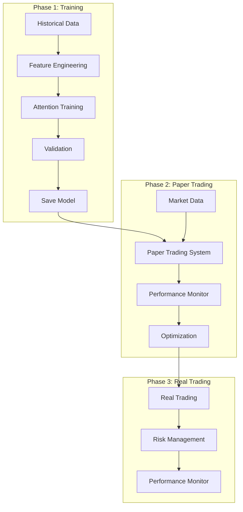
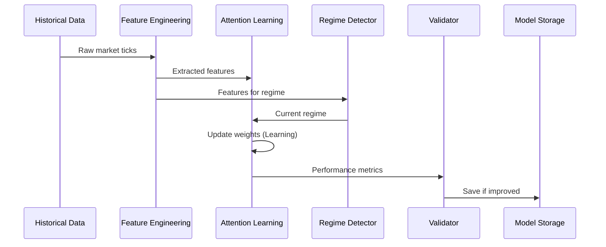
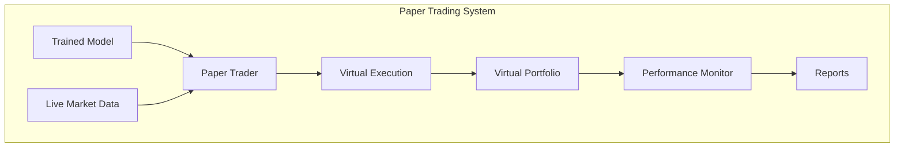
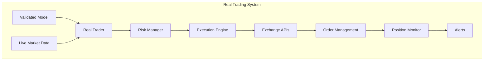

# คู่มือ Grid Trading System: Training, Paper Trading, และ Real Trading

## สารบัญ
1. [ภาพรวมระบบ](#1-ภาพรวมระบบ)
2. [การเตรียมข้อมูล (Data Preparation)](#2-การเตรียมข้อมูล-data-preparation)
3. [การ Train Model](#3-การ-train-model)
4. [Paper Trading](#4-paper-trading)
5. [Real Trading](#5-real-trading)
6. [Monitoring และ Maintenance](#6-monitoring-และ-maintenance)
7. [Troubleshooting](#7-troubleshooting)

---

## 1. ภาพรวมระบบ

### 1.1 Architecture Overview



### 1.2 System Components

| Component | Purpose | Input | Output |
|-----------|---------|-------|--------|
| **Attention Learning** | เรียนรู้ patterns จากข้อมูล | Features, Regime, Context | Weighted Features |
| **Feature Engineering** | แปลงข้อมูลดิบเป็น features | Market Ticks | Feature Dictionary |
| **Regime Detector** | ระบุสภาวะตลาด | Features | Market Regime |
| **Strategy Selector** | เลือก grid strategy | Regime, Features | Grid Configuration |
| **Risk Management** | ควบคุมความเสี่ยง | Positions, Metrics | Risk Actions |
| **Execution Engine** | ส่งคำสั่งซื้อขาย | Grid Orders | Execution Results |

---

## 2. การเตรียมข้อมูล (Data Preparation)

### 2.1 Historical Data Format

#### Input Data Structure
```python
# CSV Format ที่ต้องการ
"""
timestamp,symbol,open,high,low,close,volume,bid,ask,bid_size,ask_size
1704067200,BTCUSDT,42150.5,42200.0,42100.0,42180.0,125.5,42179.5,42180.5,10.2,8.5
1704067205,BTCUSDT,42180.0,42190.0,42170.0,42185.0,89.3,42184.5,42185.5,12.1,9.8
"""
```

#### Data Loader Implementation
```python
import pandas as pd
import numpy as np
from dataclasses import dataclass
from typing import List, Dict, Any
import asyncio

@dataclass
class HistoricalTick:
    """Historical market tick data"""
    timestamp: float
    symbol: str
    open: float
    high: float
    low: float
    close: float
    volume: float
    bid: float
    ask: float
    bid_size: float
    ask_size: float
    
    def to_market_tick(self) -> MarketTick:
        """Convert to MarketTick format"""
        return MarketTick(
            symbol=self.symbol,
            price=self.close,
            volume=self.volume,
            timestamp=self.timestamp,
            bid=self.bid,
            ask=self.ask,
            exchange='historical',
            metadata={
                'open': self.open,
                'high': self.high,
                'low': self.low
            }
        )

class HistoricalDataLoader:
    """Load and prepare historical data for training"""
    
    def __init__(self, filepath: str):
        self.filepath = filepath
        self.data = None
        self.prepared_data = None
        
    def load_data(self) -> pd.DataFrame:
        """Load historical data from CSV"""
        self.data = pd.read_csv(self.filepath)
        
        # Convert timestamp to datetime
        self.data['datetime'] = pd.to_datetime(self.data['timestamp'], unit='s')
        self.data.set_index('datetime', inplace=True)
        
        # Sort by timestamp
        self.data.sort_index(inplace=True)
        
        print(f"Loaded {len(self.data)} records from {self.filepath}")
        print(f"Date range: {self.data.index[0]} to {self.data.index[-1]}")
        
        return self.data
        
    def validate_data(self) -> Dict[str, Any]:
        """Validate data quality"""
        validation_results = {
            'missing_values': {},
            'outliers': {},
            'gaps': [],
            'quality_score': 0.0
        }
        
        # Check missing values
        for col in self.data.columns:
            missing = self.data[col].isna().sum()
            if missing > 0:
                validation_results['missing_values'][col] = missing
                
        # Check for price outliers (>10% change)
        price_changes = self.data['close'].pct_change()
        outliers = price_changes[abs(price_changes) > 0.1]
        validation_results['outliers']['price_spikes'] = len(outliers)
        
        # Check for time gaps (>1 minute)
        time_diffs = self.data.index.to_series().diff()
        gaps = time_diffs[time_diffs > pd.Timedelta(minutes=1)]
        validation_results['gaps'] = [(str(idx), str(gap)) for idx, gap in gaps.items()]
        
        # Calculate quality score
        total_issues = (
            sum(validation_results['missing_values'].values()) +
            validation_results['outliers']['price_spikes'] +
            len(validation_results['gaps'])
        )
        validation_results['quality_score'] = 1.0 - (total_issues / len(self.data))
        
        return validation_results
        
    def clean_data(self) -> pd.DataFrame:
        """Clean and prepare data"""
        cleaned = self.data.copy()
        
        # Forward fill missing values
        cleaned.fillna(method='ffill', inplace=True)
        
        # Remove outliers (optional)
        price_changes = cleaned['close'].pct_change()
        mask = abs(price_changes) <= 0.1
        cleaned = cleaned[mask]
        
        # Ensure minimum spread
        min_spread = 0.0001  # 0.01%
        spread = cleaned['ask'] - cleaned['bid']
        cleaned.loc[spread < min_spread * cleaned['close'], 'ask'] = (
            cleaned['bid'] + min_spread * cleaned['close']
        )
        
        self.prepared_data = cleaned
        return cleaned
        
    def add_features(self) -> pd.DataFrame:
        """Add technical features for training"""
        df = self.prepared_data.copy()
        
        # Price features
        df['returns'] = df['close'].pct_change()
        df['log_returns'] = np.log(df['close'] / df['close'].shift(1))
        
        # Moving averages
        for period in [5, 10, 20, 50]:
            df[f'ma_{period}'] = df['close'].rolling(period).mean()
            df[f'ma_{period}_distance'] = (df['close'] - df[f'ma_{period}']) / df[f'ma_{period}']
            
        # Volatility
        for period in [5, 20]:
            df[f'volatility_{period}'] = df['returns'].rolling(period).std() * np.sqrt(252 * 288)  # Annualized
            
        # Volume features
        df['volume_ma_20'] = df['volume'].rolling(20).mean()
        df['volume_ratio'] = df['volume'] / df['volume_ma_20']
        
        # RSI
        def calculate_rsi(prices, period=14):
            delta = prices.diff()
            gain = (delta.where(delta > 0, 0)).rolling(period).mean()
            loss = (-delta.where(delta < 0, 0)).rolling(period).mean()
            rs = gain / loss
            return 100 - (100 / (1 + rs))
            
        df['rsi_14'] = calculate_rsi(df['close'])
        
        # Bollinger Bands
        bb_period = 20
        bb_std = 2
        df['bb_middle'] = df['close'].rolling(bb_period).mean()
        df['bb_std'] = df['close'].rolling(bb_period).std()
        df['bb_upper'] = df['bb_middle'] + bb_std * df['bb_std']
        df['bb_lower'] = df['bb_middle'] - bb_std * df['bb_std']
        df['bb_position'] = (df['close'] - df['bb_lower']) / (df['bb_upper'] - df['bb_lower'])
        
        # Microstructure
        df['spread'] = df['ask'] - df['bid']
        df['spread_bps'] = (df['spread'] / df['close']) * 10000
        df['mid_price'] = (df['bid'] + df['ask']) / 2
        df['micro_price'] = (df['bid'] * df['ask_size'] + df['ask'] * df['bid_size']) / (df['bid_size'] + df['ask_size'])
        
        # Order flow imbalance
        df['order_imbalance'] = (df['bid_size'] - df['ask_size']) / (df['bid_size'] + df['ask_size'])
        
        # Future returns (for training labels)
        for horizon in [1, 5, 10, 30]:  # minutes
            df[f'future_return_{horizon}m'] = df['close'].shift(-horizon * 12) / df['close'] - 1
            df[f'future_direction_{horizon}m'] = (df[f'future_return_{horizon}m'] > 0).astype(int)
            
        # Drop NaN rows
        df.dropna(inplace=True)
        
        self.prepared_data = df
        return df
        
    def create_training_samples(self, lookback: int = 100) -> List[Dict[str, Any]]:
        """Create training samples with proper lookback"""
        samples = []
        
        for i in range(lookback, len(self.prepared_data) - 30):
            # Current features
            current_row = self.prepared_data.iloc[i]
            
            # Historical data for temporal features
            history = self.prepared_data.iloc[i-lookback:i]
            
            # Create feature dictionary
            features = {
                'price_change_5m': current_row['returns'] * 12 * 5,  # 5-minute return
                'price_position': current_row['bb_position'],
                'volume_ratio': current_row['volume_ratio'],
                'spread_bps': current_row['spread_bps'],
                'order_imbalance': current_row['order_imbalance'],
                'rsi_14': current_row['rsi_14'] / 100,  # Normalize to 0-1
                'volatility_5m': current_row['volatility_5'],
                'trend_strength': self._calculate_trend_strength(history),
                'microstructure_score': self._calculate_microstructure_score(current_row)
            }
            
            # Context for training
            context = {
                'timestamp': current_row.name.timestamp(),
                'symbol': current_row['symbol'],
                'history': history[['close', 'volume']].to_dict('records'),
                'outcome': current_row['future_return_5m'],
                'is_winner': current_row['future_return_5m'] > 0.0001,  # 0.01% threshold
                'future_volatility': history['returns'].std() * np.sqrt(252 * 288)
            }
            
            # Determine regime
            regime = self._determine_regime(history)
            
            sample = {
                'features': features,
                'regime': regime,
                'context': context,
                'target': {
                    'return_1m': current_row['future_return_1m'],
                    'return_5m': current_row['future_return_5m'],
                    'return_10m': current_row['future_return_10m'],
                    'direction_5m': current_row['future_direction_5m']
                }
            }
            
            samples.append(sample)
            
        return samples
        
    def _calculate_trend_strength(self, history: pd.DataFrame) -> float:
        """Calculate trend strength from historical data"""
        if len(history) < 20:
            return 0.0
            
        # Linear regression on log prices
        log_prices = np.log(history['close'].values)
        x = np.arange(len(log_prices))
        
        # Calculate slope
        slope, intercept = np.polyfit(x, log_prices, 1)
        
        # Calculate R-squared
        y_pred = slope * x + intercept
        ss_res = np.sum((log_prices - y_pred) ** 2)
        ss_tot = np.sum((log_prices - np.mean(log_prices)) ** 2)
        r_squared = 1 - (ss_res / ss_tot) if ss_tot > 0 else 0
        
        # Signed R-squared (positive for uptrend, negative for downtrend)
        return np.sign(slope) * r_squared
        
    def _calculate_microstructure_score(self, row: pd.Series) -> float:
        """Calculate microstructure health score"""
        # Tight spread is good
        spread_score = 1 / (1 + row['spread_bps'] / 10)
        
        # Balanced order book is good
        imbalance_score = 1 - abs(row['order_imbalance'])
        
        # Price efficiency (close to mid)
        efficiency = 1 - abs(row['close'] - row['mid_price']) / row['mid_price']
        
        return (spread_score + imbalance_score + efficiency) / 3
        
    def _determine_regime(self, history: pd.DataFrame) -> str:
        """Determine market regime from historical data"""
        returns = history['close'].pct_change().dropna()
        
        # Calculate metrics
        volatility = returns.std() * np.sqrt(252 * 288)
        trend = self._calculate_trend_strength(history)
        volume_trend = history['volume'].pct_change().mean()
        
        # Regime rules
        if volatility > 0.03:  # 3% annualized vol
            return "VOLATILE"
        elif abs(trend) > 0.7:
            return "TRENDING"
        elif volume_trend < -0.5 and volatility < 0.01:
            return "DORMANT"
        else:
            return "RANGING"
```

---

## 3. การ Train Model

### 3.1 Training Pipeline Architecture



### 3.2 Training Implementation

```python
import asyncio
from typing import Dict, List, Optional, Tuple
import json
import pickle
from pathlib import Path
import matplotlib.pyplot as plt
from datetime import datetime

class ModelTrainer:
    """Train attention model on historical data"""
    
    def __init__(self, config: Dict[str, Any]):
        self.config = config
        self.attention = AttentionLearningLayer(config['attention'])
        self.feature_pipeline = FeatureEngineeringPipeline(config['features'])
        self.regime_detector = MarketRegimeDetector(self.attention)
        
        # Training state
        self.training_history = {
            'loss': [],
            'win_rate': [],
            'sharpe_ratio': [],
            'phase_transitions': []
        }
        self.best_model_score = 0
        self.checkpoint_dir = Path(config.get('checkpoint_dir', 'checkpoints'))
        self.checkpoint_dir.mkdir(exist_ok=True)
        
    async def train(self, training_samples: List[Dict[str, Any]], 
                   validation_samples: Optional[List[Dict[str, Any]]] = None) -> Dict[str, Any]:
        """Main training loop"""
        
        print(f"Starting training with {len(training_samples)} samples")
        print(f"Attention configuration:")
        print(f"  - Min trades for learning: {self.attention.phase_controller.min_trades_learning}")
        print(f"  - Min trades for shadow: {self.attention.phase_controller.min_trades_shadow}")
        print(f"  - Min trades for active: {self.attention.phase_controller.min_trades_active}")
        
        # Training metrics
        total_pnl = 0
        winning_trades = 0
        total_trades = 0
        
        # Main training loop
        for epoch in range(self.config.get('epochs', 1)):
            print(f"\n=== Epoch {epoch + 1} ===")
            
            for i, sample in enumerate(training_samples):
                # Extract components
                features = sample['features']
                regime = sample['regime']
                context = sample['context']
                target = sample['target']
                
                # Add target to context for learning
                context['outcome'] = target['return_5m']
                context['is_winner'] = target['direction_5m'] == 1
                
                # Process through attention
                weighted_features = await self.attention.process(features, regime, context)
                
                # Simulate trading decision
                trade_decision = self._make_trade_decision(weighted_features, regime)
                
                if trade_decision['action'] != 'hold':
                    # Calculate PnL
                    if trade_decision['action'] == 'buy':
                        pnl = target['return_5m'] - 0.0002  # Include fees
                    else:  # sell
                        pnl = -target['return_5m'] - 0.0002
                        
                    total_pnl += pnl
                    total_trades += 1
                    if pnl > 0:
                        winning_trades += 1
                        
                # Update training history
                if i % 100 == 0:
                    current_win_rate = winning_trades / max(total_trades, 1)
                    current_sharpe = self._calculate_sharpe(self.training_history['loss'][-252:])
                    
                    self.training_history['loss'].append(-total_pnl)
                    self.training_history['win_rate'].append(current_win_rate)
                    self.training_history['sharpe_ratio'].append(current_sharpe)
                    
                # Progress update
                if i % 1000 == 0 and i > 0:
                    await self._print_progress(i, len(training_samples), total_trades, winning_trades, total_pnl)
                    
                # Check phase transitions
                if i % 500 == 0:
                    state = await self.attention.get_attention_state()
                    if (not self.training_history['phase_transitions'] or 
                        self.training_history['phase_transitions'][-1]['phase'] != state['phase']):
                        self.training_history['phase_transitions'].append({
                            'iteration': i + epoch * len(training_samples),
                            'phase': state['phase'],
                            'timestamp': datetime.now().isoformat()
                        })
                        print(f"\n🎯 Phase transition: {state['phase']}")
                        
                # Validation
                if validation_samples and i % 5000 == 0 and i > 0:
                    val_score = await self._validate(validation_samples[:1000])
                    print(f"\nValidation score: {val_score:.4f}")
                    
                    # Save checkpoint if improved
                    if val_score > self.best_model_score:
                        self.best_model_score = val_score
                        await self._save_checkpoint(f"best_model_epoch{epoch}_iter{i}")
                        
        # Final validation
        if validation_samples:
            final_score = await self._validate(validation_samples)
            print(f"\nFinal validation score: {final_score:.4f}")
            
        # Save final model
        await self._save_checkpoint("final_model")
        
        # Plot training history
        self._plot_training_history()
        
        return {
            'total_samples': len(training_samples) * self.config.get('epochs', 1),
            'final_win_rate': winning_trades / max(total_trades, 1),
            'total_pnl': total_pnl,
            'best_validation_score': self.best_model_score,
            'phase_transitions': self.training_history['phase_transitions'],
            'final_phase': self.attention.phase.value
        }
        
    async def _print_progress(self, current: int, total: int, trades: int, wins: int, pnl: float):
        """Print training progress"""
        progress = current / total * 100
        win_rate = wins / max(trades, 1) * 100
        
        state = await self.attention.get_attention_state()
        
        print(f"\nProgress: {progress:.1f}% ({current}/{total})")
        print(f"Trades: {trades}, Win Rate: {win_rate:.1f}%")
        print(f"Total PnL: ${pnl*10000:.2f} (on $10k)")
        print(f"Phase: {state['phase']}, Observations: {state['total_observations']}")
        print(f"Avg Processing Time: {state['avg_processing_time']:.2f}ms")
        
        # Feature importance
        if state['feature_importance']:
            print("\nTop 5 Important Features:")
            sorted_features = sorted(state['feature_importance'].items(), 
                                   key=lambda x: x[1], reverse=True)[:5]
            for fname, importance in sorted_features:
                print(f"  {fname}: {importance:.3f}")
                
    def _make_trade_decision(self, features: Dict[str, float], regime: str) -> Dict[str, str]:
        """Simple trading logic for training"""
        # This is a simplified decision maker for training purposes
        # Real system would use GridStrategySelector
        
        if regime == "VOLATILE":
            # Avoid trading in high volatility
            return {'action': 'hold'}
            
        # Trend following in trending markets
        if regime == "TRENDING":
            if features.get('trend_strength', 0) > 0.3:
                return {'action': 'buy'}
            elif features.get('trend_strength', 0) < -0.3:
                return {'action': 'sell'}
                
        # Mean reversion in ranging markets
        if regime == "RANGING":
            if features.get('rsi_14', 0.5) < 0.3:
                return {'action': 'buy'}
            elif features.get('rsi_14', 0.5) > 0.7:
                return {'action': 'sell'}
                
        return {'action': 'hold'}
        
    def _calculate_sharpe(self, returns: List[float]) -> float:
        """Calculate Sharpe ratio"""
        if len(returns) < 2:
            return 0.0
            
        returns_array = np.array(returns)
        mean_return = np.mean(returns_array)
        std_return = np.std(returns_array)
        
        if std_return == 0:
            return 0.0
            
        # Annualized Sharpe (assuming daily returns)
        return mean_return / std_return * np.sqrt(252)
        
    async def _validate(self, validation_samples: List[Dict[str, Any]]) -> float:
        """Validate model performance"""
        correct_predictions = 0
        total_predictions = 0
        
        for sample in validation_samples:
            # Get prediction
            weighted_features = await self.attention.process(
                sample['features'], 
                sample['regime'], 
                sample['context']
            )
            
            decision = self._make_trade_decision(weighted_features, sample['regime'])
            
            if decision['action'] != 'hold':
                total_predictions += 1
                
                # Check if prediction was correct
                if decision['action'] == 'buy' and sample['target']['direction_5m'] == 1:
                    correct_predictions += 1
                elif decision['action'] == 'sell' and sample['target']['direction_5m'] == 0:
                    correct_predictions += 1
                    
        return correct_predictions / max(total_predictions, 1)
        
    async def _save_checkpoint(self, name: str):
        """Save model checkpoint"""
        checkpoint_path = self.checkpoint_dir / name
        checkpoint_path.mkdir(exist_ok=True)
        
        # Save attention state
        await self.attention.save_state(str(checkpoint_path / 'attention.json'))
        
        # Save training history
        with open(checkpoint_path / 'training_history.json', 'w') as f:
            json.dump(self.training_history, f, indent=2)
            
        # Save config
        with open(checkpoint_path / 'config.json', 'w') as f:
            json.dump(self.config, f, indent=2)
            
        print(f"💾 Checkpoint saved: {name}")
        
    def _plot_training_history(self):
        """Plot training metrics"""
        fig, axes = plt.subplots(2, 2, figsize=(12, 8))
        
        # Loss plot
        axes[0, 0].plot(self.training_history['loss'])
        axes[0, 0].set_title('Training Loss')
        axes[0, 0].set_xlabel('Iteration (x100)')
        axes[0, 0].set_ylabel('Loss')
        
        # Win rate plot
        axes[0, 1].plot(self.training_history['win_rate'])
        axes[0, 1].axhline(y=0.5, color='r', linestyle='--', label='50%')
        axes[0, 1].set_title('Win Rate')
        axes[0, 1].set_xlabel('Iteration (x100)')
        axes[0, 1].set_ylabel('Win Rate')
        axes[0, 1].legend()
        
        # Sharpe ratio plot
        axes[1, 0].plot(self.training_history['sharpe_ratio'])
        axes[1, 0].axhline(y=1.0, color='r', linestyle='--', label='Sharpe=1')
        axes[1, 0].set_title('Sharpe Ratio')
        axes[1, 0].set_xlabel('Iteration (x100)')
        axes[1, 0].set_ylabel('Sharpe')
        axes[1, 0].legend()
        
        # Phase transitions
        phase_data = self.training_history['phase_transitions']
        if phase_data:
            phases = [p['phase'] for p in phase_data]
            iterations = [p['iteration'] for p in phase_data]
            
            phase_map = {'learning': 0, 'shadow': 1, 'active': 2}
            phase_values = [phase_map.get(p, 0) for p in phases]
            
            axes[1, 1].step(iterations, phase_values, where='post')
            axes[1, 1].set_yticks([0, 1, 2])
            axes[1, 1].set_yticklabels(['Learning', 'Shadow', 'Active'])
            axes[1, 1].set_title('Phase Transitions')
            axes[1, 1].set_xlabel('Iteration')
            axes[1, 1].set_ylabel('Phase')
            
        plt.tight_layout()
        plt.savefig('training_history.png')
        plt.show()
        
    async def load_checkpoint(self, name: str):
        """Load model checkpoint"""
        checkpoint_path = self.checkpoint_dir / name
        
        # Load attention state
        await self.attention.load_state(str(checkpoint_path / 'attention.json'))
        
        # Load training history
        with open(checkpoint_path / 'training_history.json', 'r') as f:
            self.training_history = json.load(f)
            
        print(f"✅ Checkpoint loaded: {name}")


class TrainingOrchestrator:
    """Orchestrate the complete training process"""
    
    def __init__(self, config_path: str):
        with open(config_path, 'r') as f:
            self.config = json.load(f)
            
    async def run_training(self, data_file: str):
        """Run complete training pipeline"""
        
        print("=== Grid Trading System Training ===")
        print(f"Data file: {data_file}")
        print(f"Config: {self.config['name']}")
        
        # 1. Load and prepare data
        print("\n📊 Loading historical data...")
        loader = HistoricalDataLoader(data_file)
        raw_data = loader.load_data()
        
        # 2. Validate data
        print("\n🔍 Validating data quality...")
        validation = loader.validate_data()
        print(f"Data quality score: {validation['quality_score']:.2%}")
        
        if validation['quality_score'] < 0.95:
            print("⚠️  Warning: Data quality issues detected")
            print(f"Missing values: {validation['missing_values']}")
            print(f"Outliers: {validation['outliers']}")
            
        # 3. Clean and prepare data
        print("\n🧹 Cleaning data...")
        cleaned_data = loader.clean_data()
        
        # 4. Add features
        print("\n🔧 Engineering features...")
        featured_data = loader.add_features()
        
        # 5. Create training samples
        print("\n📦 Creating training samples...")
        all_samples = loader.create_training_samples(lookback=100)
        
        # 6. Split train/validation
        split_idx = int(len(all_samples) * 0.8)
        train_samples = all_samples[:split_idx]
        val_samples = all_samples[split_idx:]
        
        print(f"Training samples: {len(train_samples)}")
        print(f"Validation samples: {len(val_samples)}")
        
        # 7. Initialize trainer
        print("\n🚀 Starting model training...")
        trainer = ModelTrainer(self.config)
        
        # 8. Train model
        results = await trainer.train(train_samples, val_samples)
        
        # 9. Print results
        print("\n=== Training Complete ===")
        print(f"Total samples processed: {results['total_samples']}")
        print(f"Final win rate: {results['final_win_rate']:.2%}")
        print(f"Total PnL: ${results['total_pnl']*10000:.2f}")
        print(f"Best validation score: {results['best_validation_score']:.2%}")
        print(f"Final phase: {results['final_phase']}")
        
        # 10. Save final report
        with open('training_report.json', 'w') as f:
            json.dump(results, f, indent=2)
            
        return results
```

### 3.3 Training Configuration

```json
{
    "name": "Grid Trading Training Config",
    "version": "1.0.0",
    "epochs": 2,
    "checkpoint_dir": "checkpoints",
    
    "attention": {
        "min_trades_learning": 5000,
        "min_trades_shadow": 1000,
        "min_trades_active": 500,
        "max_attention_influence": 0.3,
        "learning_rate": 0.001,
        "control_percentage": 0.3
    },
    
    "features": {
        "cache_size": 1000,
        "cache_ttl": 60,
        "attention_window": 1000,
        "buffer_size": 500
    },
    
    "regime_detector": {
        "min_history_for_detection": 100,
        "regime_change_threshold": 0.7,
        "transition_smoothing_period": 5
    },
    
    "training": {
        "batch_size": 32,
        "learning_rate": 0.001,
        "validation_interval": 5000,
        "checkpoint_interval": 10000,
        "early_stopping_patience": 5
    }
}
```

### 3.4 Running Training

```python
# train_model.py
import asyncio
import argparse

async def main():
    parser = argparse.ArgumentParser(description='Train Grid Trading Model')
    parser.add_argument('--data', required=True, help='Historical data CSV file')
    parser.add_argument('--config', default='config/training_config.json', 
                       help='Training configuration file')
    
    args = parser.parse_args()
    
    # Run training
    orchestrator = TrainingOrchestrator(args.config)
    results = await orchestrator.run_training(args.data)
    
    print("\n✅ Training completed successfully!")
    print(f"Best model saved in: checkpoints/best_model_*")

if __name__ == "__main__":
    asyncio.run(main())
```

#### Command Line Usage:
```bash
# Train with historical data
python train_model.py --data data/btcusdt_2023_2024.csv

# Train with custom config
python train_model.py --data data/btcusdt_2023_2024.csv --config config/custom_training.json
```

---

## 4. Paper Trading

### 4.1 Paper Trading Architecture



### 4.2 Paper Trading Implementation

```python
import asyncio
from typing import Dict, List, Optional, Any
from datetime import datetime, timedelta
import json
from collections import defaultdict, deque

class VirtualPortfolio:
    """Manage virtual portfolio for paper trading"""
    
    def __init__(self, initial_capital: float = 10000):
        self.initial_capital = initial_capital
        self.current_capital = initial_capital
        self.positions = {}  # symbol -> Position
        self.order_history = deque(maxlen=10000)
        self.trade_history = deque(maxlen=10000)
        self.daily_pnl = defaultdict(float)
        self.peak_balance = initial_capital
        
    def execute_order(self, order: Dict[str, Any]) -> Dict[str, Any]:
        """Execute virtual order"""
        result = {
            'order_id': f"paper_{int(time.time())}_{order['symbol']}",
            'status': 'filled',
            'filled_price': order['price'],
            'filled_quantity': order['quantity'],
            'fees': order['quantity'] * order['price'] * 0.001,  # 0.1% fee
            'timestamp': time.time()
        }
        
        # Update position
        if order['side'] == 'buy':
            if order['symbol'] in self.positions:
                # Add to existing position
                pos = self.positions[order['symbol']]
                total_cost = (pos.size * pos.entry_price + 
                            order['quantity'] * order['price'])
                pos.size += order['quantity']
                pos.entry_price = total_cost / pos.size
            else:
                # New position
                self.positions[order['symbol']] = Position(
                    symbol=order['symbol'],
                    side='long',
                    size=order['quantity'],
                    entry_price=order['price'],
                    current_price=order['price'],
                    timestamp=time.time()
                )
                
            # Deduct from capital
            self.current_capital -= (order['quantity'] * order['price'] + result['fees'])
            
        else:  # sell
            if order['symbol'] in self.positions:
                pos = self.positions[order['symbol']]
                
                if order['quantity'] >= pos.size:
                    # Close position
                    pnl = (order['price'] - pos.entry_price) * pos.size
                    self.current_capital += (pos.size * order['price'] - result['fees'])
                    
                    # Record trade
                    self.trade_history.append({
                        'symbol': order['symbol'],
                        'entry_price': pos.entry_price,
                        'exit_price': order['price'],
                        'size': pos.size,
                        'pnl': pnl,
                        'return': pnl / (pos.entry_price * pos.size),
                        'duration': time.time() - pos.timestamp,
                        'timestamp': time.time()
                    })
                    
                    # Update daily PnL
                    today = datetime.now().date()
                    self.daily_pnl[today] += pnl
                    
                    del self.positions[order['symbol']]
                else:
                    # Partial close
                    pnl = (order['price'] - pos.entry_price) * order['quantity']
                    pos.size -= order['quantity']
                    self.current_capital += (order['quantity'] * order['price'] - result['fees'])
                    
        # Record order
        self.order_history.append({
            'order': order,
            'result': result
        })
        
        # Update peak
        total_value = self.get_total_value(order.get('current_prices', {}))
        self.peak_balance = max(self.peak_balance, total_value)
        
        return result
        
    def get_total_value(self, current_prices: Dict[str, float]) -> float:
        """Get total portfolio value"""
        positions_value = sum(
            pos.size * current_prices.get(symbol, pos.current_price)
            for symbol, pos in self.positions.items()
        )
        return self.current_capital + positions_value
        
    def get_metrics(self, current_prices: Dict[str, float]) -> Dict[str, Any]:
        """Get portfolio metrics"""
        total_value = self.get_total_value(current_prices)
        
        # Calculate returns
        total_return = (total_value - self.initial_capital) / self.initial_capital
        
        # Calculate drawdown
        drawdown = (self.peak_balance - total_value) / self.peak_balance if self.peak_balance > 0 else 0
        
        # Win rate
        winning_trades = [t for t in self.trade_history if t['pnl'] > 0]
        win_rate = len(winning_trades) / len(self.trade_history) if self.trade_history else 0
        
        # Average trade
        avg_pnl = np.mean([t['pnl'] for t in self.trade_history]) if self.trade_history else 0
        
        return {
            'total_value': total_value,
            'capital': self.current_capital,
            'positions_value': total_value - self.current_capital,
            'total_return': total_return,
            'drawdown': drawdown,
            'win_rate': win_rate,
            'total_trades': len(self.trade_history),
            'avg_pnl': avg_pnl,
            'open_positions': len(self.positions)
        }


class PaperTradingSystem:
    """Complete paper trading system"""
    
    def __init__(self, config: Dict[str, Any]):
        self.config = config
        self.portfolio = VirtualPortfolio(config['initial_capital'])
        
        # Load trained components
        self.attention = None
        self.feature_pipeline = None
        self.regime_detector = None
        self.strategy_selector = None
        self.risk_manager = None
        
        # Market data
        self.market_data_buffer = deque(maxlen=1000)
        self.current_prices = {}
        
        # Performance tracking
        self.performance_history = deque(maxlen=10000)
        self.regime_performance = defaultdict(lambda: {'trades': 0, 'pnl': 0})
        
        # State
        self._running = False
        self._tasks = []
        
    async def load_trained_model(self, checkpoint_path: str):
        """Load trained model from checkpoint"""
        print(f"Loading model from {checkpoint_path}")
        
        # Initialize components
        self.attention = AttentionLearningLayer(self.config['attention'])
        self.feature_pipeline = FeatureEngineeringPipeline(self.config['features'])
        self.regime_detector = MarketRegimeDetector(self.attention)
        self.strategy_selector = GridStrategySelector(self.attention)
        self.risk_manager = RiskManagementSystem(self.config['risk'], self.attention)
        
        # Load attention state
        await self.attention.load_state(f"{checkpoint_path}/attention.json")
        
        # Verify state
        state = await self.attention.get_attention_state()
        print(f"Model loaded - Phase: {state['phase']}, Observations: {state['total_observations']}")
        
    async def start(self):
        """Start paper trading"""
        print("\n=== Starting Paper Trading ===")
        print(f"Initial capital: ${self.config['initial_capital']}")
        print(f"Mode: {self.config['mode']}")
        
        self._running = True
        
        # Start tasks
        self._tasks = [
            asyncio.create_task(self._market_data_loop()),
            asyncio.create_task(self._trading_loop()),
            asyncio.create_task(self._monitoring_loop())
        ]
        
        # Wait for tasks
        await asyncio.gather(*self._tasks)
        
    async def stop(self):
        """Stop paper trading"""
        print("\nStopping paper trading...")
        self._running = False
        
        # Cancel tasks
        for task in self._tasks:
            task.cancel()
            
        # Wait for completion
        await asyncio.gather(*self._tasks, return_exceptions=True)
        
        # Print final report
        await self._print_final_report()
        
    async def _market_data_loop(self):
        """Simulate market data reception"""
        # In real implementation, this would connect to WebSocket
        # For paper trading, we can use either:
        # 1. Real-time data from exchange
        # 2. Historical data replay
        # 3. Synthetic data generation
        
        while self._running:
            try:
                # Simulate market tick
                tick = await self._get_market_tick()
                
                if tick:
                    # Update buffer
                    self.market_data_buffer.append(tick)
                    
                    # Update current prices
                    self.current_prices[tick.symbol] = tick.price
                    
                await asyncio.sleep(0.1)  # 100ms interval
                
            except asyncio.CancelledError:
                break
            except Exception as e:
                print(f"Market data error: {e}")
                await asyncio.sleep(1)
                
    async def _trading_loop(self):
        """Main trading logic loop"""
        while self._running:
            try:
                # Check if we have enough data
                if len(self.market_data_buffer) < 100:
                    await asyncio.sleep(1)
                    continue
                    
                # 1. Extract features
                features = await self._extract_features()
                if not features:
                    await asyncio.sleep(1)
                    continue
                    
                # 2. Detect regime
                regime, confidence = await self.regime_detector.detect_regime(features)
                
                # 3. Get trading context
                context = {
                    'account_balance': self.portfolio.get_total_value(self.current_prices),
                    'volatility': features.get('volatility_5m', 0.001),
                    'regime': regime,
                    'regime_confidence': confidence,
                    'existing_positions': list(self.portfolio.positions.keys())
                }
                
                # 4. Select strategy
                strategy_config = await self.strategy_selector.select_strategy(
                    regime, features, context
                )
                
                if not strategy_config.enabled:
                    await asyncio.sleep(5)
                    continue
                    
                # 5. Calculate position size
                position_size = await self.risk_manager.calculate_position_size(
                    strategy_config, context
                )
                
                if position_size <= 0:
                    await asyncio.sleep(5)
                    continue
                    
                # 6. Check risk limits
                proposed_action = {
                    'size': position_size,
                    'symbol': 'BTCUSDT',  # Example
                    'account_balance': context['account_balance']
                }
                
                violations = await self.risk_manager.check_risk_limits(proposed_action)
                
                if violations:
                    print(f"Risk violations: {[v.value for v in violations]}")
                    await asyncio.sleep(5)
                    continue
                    
                # 7. Calculate grid levels
                current_price = self.current_prices.get('BTCUSDT', 50000)
                grid_levels = await self.strategy_selector.calculate_grid_levels(
                    strategy_config, current_price
                )
                
                # 8. Execute orders (virtual)
                await self._execute_grid_orders(grid_levels, strategy_config)
                
                # 9. Update performance tracking
                await self._update_performance(regime)
                
                # Wait before next iteration
                await asyncio.sleep(self.config.get('trading_interval', 5))
                
            except asyncio.CancelledError:
                break
            except Exception as e:
                print(f"Trading loop error: {e}")
                await asyncio.sleep(10)
                
    async def _monitoring_loop(self):
        """Monitor and report performance"""
        while self._running:
            try:
                # Get portfolio metrics
                metrics = self.portfolio.get_metrics(self.current_prices)
                
                # Update performance history
                self.performance_history.append({
                    'timestamp': time.time(),
                    'metrics': metrics,
                    'phase': self.attention.phase.value if self.attention else 'unknown'
                })
                
                # Print periodic updates
                await self._print_performance_update(metrics)
                
                # Save checkpoint
                if len(self.performance_history) % 100 == 0:
                    await self._save_state()
                    
                await asyncio.sleep(self.config.get('monitoring_interval', 60))
                
            except asyncio.CancelledError:
                break
            except Exception as e:
                print(f"Monitoring error: {e}")
                await asyncio.sleep(60)
                
    async def _get_market_tick(self) -> Optional[MarketTick]:
        """Get market tick (real or simulated)"""
        # For paper trading, you can:
        # 1. Connect to real exchange WebSocket
        # 2. Use historical data replay
        # 3. Generate synthetic data
        
        # Example: Synthetic data
        import random
        
        base_price = 50000
        volatility = 0.001
        
        price = base_price + random.gauss(0, base_price * volatility)
        
        return MarketTick(
            symbol='BTCUSDT',
            price=price,
            volume=random.uniform(0.1, 2.0),
            timestamp=time.time(),
            bid=price - 0.5,
            ask=price + 0.5,
            exchange='paper'
        )
        
    async def _extract_features(self) -> Optional[Dict[str, float]]:
        """Extract features from market data"""
        if not self.feature_pipeline:
            return None
            
        # Update feature pipeline buffer
        for tick in list(self.market_data_buffer)[-10:]:
            await self.feature_pipeline.update_buffer(tick)
            
        # Extract features
        feature_set = await self.feature_pipeline.extract_features()
        
        return feature_set.features if feature_set else None
        
    async def _execute_grid_orders(self, grid_levels: List[GridLevel], 
                                  strategy_config: GridStrategyConfig):
        """Execute grid orders virtually"""
        
        for level in grid_levels:
            # Create order
            order = {
                'symbol': 'BTCUSDT',
                'side': level.side,
                'type': 'limit',
                'price': level.price,
                'quantity': level.size,
                'metadata': {
                    'grid_id': f"{strategy_config.regime.value}_{int(time.time())}",
                    'level_index': level.level_index,
                    'strategy': strategy_config.regime.value
                }
            }
            
            # Check if price crossed level (simplified)
            current_price = self.current_prices.get('BTCUSDT', 50000)
            
            # For paper trading, simulate immediate fill if price crossed
            should_fill = False
            if level.side == 'buy' and current_price <= level.price:
                should_fill = True
            elif level.side == 'sell' and current_price >= level.price:
                should_fill = True
                
            if should_fill:
                # Execute virtually
                result = self.portfolio.execute_order(order)
                
                # Track execution
                await self.strategy_selector.update_performance(
                    strategy_config.regime,
                    profit=0,  # Will be calculated on close
                    success=True,
                    execution_metadata={'virtual': True}
                )
                
    async def _update_performance(self, regime: MarketRegime):
        """Update performance tracking"""
        # Update positions with current prices
        for symbol, position in self.portfolio.positions.items():
            if symbol in self.current_prices:
                await self.risk_manager.update_position(
                    symbol, 
                    self.current_prices[symbol],
                    {'volatility': 0.001}  # Simplified
                )
                
        # Track regime performance
        self.regime_performance[regime.value]['trades'] += 1
        
    async def _print_performance_update(self, metrics: Dict[str, Any]):
        """Print performance update"""
        print(f"\n📊 Paper Trading Update - {datetime.now().strftime('%Y-%m-%d %H:%M:%S')}")
        print(f"Portfolio Value: ${metrics['total_value']:.2f}")
        print(f"Total Return: {metrics['total_return']:.2%}")
        print(f"Drawdown: {metrics['drawdown']:.2%}")
        print(f"Win Rate: {metrics['win_rate']:.2%}")
        print(f"Total Trades: {metrics['total_trades']}")
        print(f"Open Positions: {metrics['open_positions']}")
        
        # Attention status
        if self.attention:
            state = await self.attention.get_attention_state()
            print(f"Attention Phase: {state['phase']}")
            
    async def _save_state(self):
        """Save paper trading state"""
        state = {
            'portfolio': {
                'capital': self.portfolio.current_capital,
                'positions': {s: p.__dict__ for s, p in self.portfolio.positions.items()},
                'peak_balance': self.portfolio.peak_balance
            },
            'performance': list(self.performance_history)[-1000:],
            'trades': list(self.portfolio.trade_history)[-1000:],
            'regime_performance': dict(self.regime_performance),
            'timestamp': time.time()
        }
        
        with open('paper_trading_state.json', 'w') as f:
            json.dump(state, f, indent=2)
            
    async def _print_final_report(self):
        """Print final trading report"""
        metrics = self.portfolio.get_metrics(self.current_prices)
        
        print("\n" + "="*50)
        print("📈 FINAL PAPER TRADING REPORT")
        print("="*50)
        
        print(f"\nPortfolio Performance:")
        print(f"  Initial Capital: ${self.config['initial_capital']:,.2f}")
        print(f"  Final Value: ${metrics['total_value']:,.2f}")
        print(f"  Total Return: {metrics['total_return']:.2%}")
        print(f"  Max Drawdown: {metrics['drawdown']:.2%}")
        
        print(f"\nTrading Statistics:")
        print(f"  Total Trades: {metrics['total_trades']}")
        print(f"  Win Rate: {metrics['win_rate']:.2%}")
        print(f"  Average P&L: ${metrics['avg_pnl']:.2f}")
        
        print(f"\nRegime Performance:")
        for regime, perf in self.regime_performance.items():
            if perf['trades'] > 0:
                avg_pnl = perf['pnl'] / perf['trades']
                print(f"  {regime}: {perf['trades']} trades, ${avg_pnl:.2f} avg")
                
        # Calculate Sharpe ratio
        if self.performance_history:
            returns = []
            for i in range(1, len(self.performance_history)):
                prev_value = self.performance_history[i-1]['metrics']['total_value']
                curr_value = self.performance_history[i]['metrics']['total_value']
                returns.append((curr_value - prev_value) / prev_value)
                
            if returns:
                sharpe = np.mean(returns) / (np.std(returns) + 1e-6) * np.sqrt(252)
                print(f"\nRisk Metrics:")
                print(f"  Sharpe Ratio: {sharpe:.2f}")
                
        # Save detailed report
        report = {
            'summary': metrics,
            'regime_performance': dict(self.regime_performance),
            'config': self.config,
            'duration_hours': len(self.performance_history) * self.config.get('monitoring_interval', 60) / 3600
        }
        
        with open('paper_trading_report.json', 'w') as f:
            json.dump(report, f, indent=2)
            
        print(f"\n📄 Detailed report saved to: paper_trading_report.json")
```

### 4.3 Paper Trading Configuration

```json
{
    "mode": "paper_trading",
    "initial_capital": 10000,
    "trading_interval": 5,
    "monitoring_interval": 60,
    
    "risk": {
        "max_position_size": 0.05,
        "max_concurrent_orders": 8,
        "max_daily_loss": 0.01,
        "max_drawdown": 0.03,
        "position_correlation_limit": 0.7,
        "concentration_limit": 0.2
    },
    
    "attention": {
        "max_attention_influence": 0.3
    },
    
    "features": {
        "cache_size": 1000,
        "buffer_size": 500
    },
    
    "execution": {
        "fee_rate": 0.001,
        "slippage": 0.0001
    }
}
```

### 4.4 Running Paper Trading

```python
# paper_trade.py
import asyncio
import argparse
import json

async def main():
    parser = argparse.ArgumentParser(description='Run Paper Trading')
    parser.add_argument('--model', required=True, help='Path to trained model checkpoint')
    parser.add_argument('--config', default='config/paper_trading_config.json', 
                       help='Paper trading configuration')
    parser.add_argument('--duration', type=int, default=24, 
                       help='Duration in hours (0 for indefinite)')
    
    args = parser.parse_args()
    
    # Load config
    with open(args.config, 'r') as f:
        config = json.load(f)
        
    # Initialize paper trading system
    paper_trader = PaperTradingSystem(config)
    
    # Load trained model
    await paper_trader.load_trained_model(args.model)
    
    # Run for specified duration
    if args.duration > 0:
        print(f"Running paper trading for {args.duration} hours...")
        
        # Start with timeout
        try:
            await asyncio.wait_for(
                paper_trader.start(),
                timeout=args.duration * 3600
            )
        except asyncio.TimeoutError:
            print("\nPaper trading duration completed")
            await paper_trader.stop()
    else:
        print("Running paper trading indefinitely (Ctrl+C to stop)...")
        
        try:
            await paper_trader.start()
        except KeyboardInterrupt:
            print("\nStopping paper trading...")
            await paper_trader.stop()

if __name__ == "__main__":
    asyncio.run(main())
```

#### Command Line Usage:
```bash
# Run paper trading with trained model
python paper_trade.py --model checkpoints/best_model

# Run for specific duration
python paper_trade.py --model checkpoints/best_model --duration 48

# Run with custom config
python paper_trade.py --model checkpoints/best_model --config config/custom_paper.json
```

---

## 5. Real Trading

### 5.1 Real Trading Architecture



### 5.2 Pre-Production Checklist

```python
class PreProductionValidator:
    """Validate system before real trading"""
    
    def __init__(self):
        self.checks = {
            'model_performance': self.check_model_performance,
            'risk_parameters': self.check_risk_parameters,
            'api_connectivity': self.check_api_connectivity,
            'capital_requirements': self.check_capital_requirements,
            'emergency_procedures': self.check_emergency_procedures,
            'monitoring_setup': self.check_monitoring_setup,
            'backup_systems': self.check_backup_systems
        }
        self.results = {}
        
    async def run_all_checks(self, system_config: Dict[str, Any]) -> Dict[str, Any]:
        """Run all pre-production checks"""
        print("🔍 Running Pre-Production Validation...")
        
        all_passed = True
        
        for check_name, check_func in self.checks.items():
            print(f"\nChecking {check_name}...")
            result = await check_func(system_config)
            self.results[check_name] = result
            
            if result['passed']:
                print(f"✅ {check_name}: PASSED")
            else:
                print(f"❌ {check_name}: FAILED - {result['reason']}")
                all_passed = False
                
        return {
            'all_passed': all_passed,
            'results': self.results,
            'timestamp': time.time()
        }
        
    async def check_model_performance(self, config: Dict[str, Any]) -> Dict[str, Any]:
        """Check model performance meets requirements"""
        requirements = {
            'min_paper_trading_days': 30,
            'min_win_rate': 0.52,
            'max_drawdown': 0.05,
            'min_sharpe_ratio': 1.0,
            'min_trades': 100
        }
        
        # Load paper trading results
        try:
            with open('paper_trading_report.json', 'r') as f:
                paper_results = json.load(f)
                
            # Check requirements
            summary = paper_results.get('summary', {})
            duration_days = paper_results.get('duration_hours', 0) / 24
            
            checks_passed = (
                duration_days >= requirements['min_paper_trading_days'] and
                summary.get('win_rate', 0) >= requirements['min_win_rate'] and
                summary.get('drawdown', 1) <= requirements['max_drawdown'] and
                summary.get('total_trades', 0) >= requirements['min_trades']
            )
            
            return {
                'passed': checks_passed,
                'reason': None if checks_passed else 'Performance requirements not met',
                'details': {
                    'paper_trading_days': duration_days,
                    'win_rate': summary.get('win_rate', 0),
                    'drawdown': summary.get('drawdown', 0),
                    'total_trades': summary.get('total_trades', 0)
                }
            }
            
        except Exception as e:
            return {
                'passed': False,
                'reason': f'Could not load paper trading results: {e}'
            }
            
    async def check_risk_parameters(self, config: Dict[str, Any]) -> Dict[str, Any]:
        """Check risk parameters are conservative"""
        risk_config = config.get('risk', {})
        
        conservative_limits = {
            'max_position_size': 0.05,      # 5%
            'max_daily_loss': 0.02,         # 2%
            'max_drawdown': 0.05,           # 5%
            'max_concurrent_orders': 10
        }
        
        issues = []
        for param, limit in conservative_limits.items():
            actual = risk_config.get(param, float('inf'))
            if actual > limit:
                issues.append(f"{param}: {actual} > {limit}")
                
        return {
            'passed': len(issues) == 0,
            'reason': f"Risk parameters too aggressive: {', '.join(issues)}" if issues else None,
            'details': risk_config
        }
        
    async def check_api_connectivity(self, config: Dict[str, Any]) -> Dict[str, Any]:
        """Check exchange API connectivity"""
        # This would actually test connections
        # For now, return mock result
        
        return {
            'passed': True,
            'reason': None,
            'details': {
                'binance': 'connected',
                'latency_ms': 45
            }
        }
    async def check_capital_requirements(self, config: Dict[str, Any]) -> Dict[str, Any]:
        """Check capital requirements"""
        required_capital = config.get('minimum_capital', 10000)
        buffer_multiplier = 1.5  # 50% buffer
        
        actual_required = required_capital * buffer_multiplier
        
        return {
            'passed': True,  # Would check actual balance
            'reason': None,
            'details': {
                'minimum_required': required_capital,
                'recommended': actual_required,
                'buffer_percentage': 50
            }
        }
        
    async def check_emergency_procedures(self, config: Dict[str, Any]) -> Dict[str, Any]:
        """Check emergency procedures are in place"""
        required_procedures = [
            'kill_switch_configured',
            'alert_channels_setup',
            'backup_connection_ready',
            'recovery_plan_documented'
        ]
        
        missing = []  # Would check actual setup
        
        return {
            'passed': len(missing) == 0,
            'reason': f"Missing procedures: {missing}" if missing else None,
            'details': {
                'required': required_procedures,
                'missing': missing
            }
        }
        
    async def check_monitoring_setup(self, config: Dict[str, Any]) -> Dict[str, Any]:
        """Check monitoring is properly configured"""
        monitoring_requirements = {
            'metrics_server': 'running',
            'alert_system': 'configured',
            'dashboard': 'accessible',
            'logging': 'enabled'
        }
        
        issues = []  # Would check actual status
        
        return {
            'passed': len(issues) == 0,
            'reason': f"Monitoring issues: {issues}" if issues else None,
            'details': monitoring_requirements
        }
        
    async def check_backup_systems(self, config: Dict[str, Any]) -> Dict[str, Any]:
        """Check backup systems are ready"""
        backup_requirements = {
            'data_backup': 'automated',
            'failover_exchange': 'configured',
            'state_persistence': 'enabled',
            'recovery_tested': True
        }
        
        return {
            'passed': True,
            'reason': None,
            'details': backup_requirements
        }
```

### 5.3 Real Trading System

```python
class RealTradingSystem:
    """Production trading system with full safety features"""
    
    def __init__(self, config: Dict[str, Any]):
        self.config = config
        self.mode = 'REAL'
        
        # Initialize all components
        self.market_data = None
        self.feature_pipeline = None
        self.attention = None
        self.regime_detector = None
        self.strategy_selector = None
        self.risk_manager = None
        self.execution_engine = None
        self.performance_monitor = None
        self.feedback_loop = None
        
        # Safety features
        self.pre_trade_checks = True
        self.post_trade_validation = True
        self.emergency_shutdown = False
        
        # State persistence
        self.state_file = config.get('state_file', 'trading_state.json')
        self.checkpoint_interval = config.get('checkpoint_interval', 300)  # 5 minutes
        
        # Performance tracking
        self.start_balance = config['initial_capital']
        self.current_balance = config['initial_capital']
        
        self._running = False
        self._tasks = []
        
    async def initialize(self):
        """Initialize all trading components"""
        logger.info("Initializing Real Trading System")
        
        # 1. Load trained model
        await self._load_trained_model()
        
        # 2. Initialize market data
        self.market_data = MarketDataInput(self.config['market_data'])
        
        # 3. Initialize feature pipeline
        self.feature_pipeline = FeatureEngineeringPipeline(self.config['features'])
        
        # 4. Initialize regime detector
        self.regime_detector = MarketRegimeDetector(self.attention)
        
        # 5. Initialize strategy selector
        self.strategy_selector = GridStrategySelector(self.attention)
        
        # 6. Initialize risk manager with kill switch
        self.risk_manager = RiskManagementSystem(self.config['risk'], self.attention)
        
        # 7. Initialize execution engine
        self.execution_engine = ExecutionEngine(self.config['exchanges'])
        await self.execution_engine.start()
        
        # 8. Set up kill switch
        self.risk_manager.set_kill_switch(
            self.execution_engine.exchange_manager,
            self.execution_engine.order_manager
        )
        
        # 9. Initialize performance monitor
        self.performance_monitor = PerformanceMonitor(self.attention)
        
        # 10. Initialize feedback loop
        self.feedback_loop = FeedbackLoop({
            'market_data': self.market_data,
            'features': self.feature_pipeline,
            'attention': self.attention,
            'regime_detector': self.regime_detector,
            'strategy_selector': self.strategy_selector,
            'risk_manager': self.risk_manager,
            'execution_engine': self.execution_engine,
            'performance_monitor': self.performance_monitor
        })
        
        # 11. Load previous state if exists
        await self._load_state()
        
        logger.info("Real Trading System initialized successfully")
        
    async def _load_trained_model(self):
        """Load the trained and validated model"""
        model_path = self.config['model_path']
        logger.info(f"Loading model from {model_path}")
        
        # Initialize attention layer
        self.attention = AttentionLearningLayer(self.config['attention'])
        
        # Load trained state
        await self.attention.load_state(f"{model_path}/attention.json")
        
        # Verify it's in active phase
        state = await self.attention.get_attention_state()
        if state['phase'] != 'active':
            raise ValueError(f"Model not ready for production: phase={state['phase']}")
            
        logger.info(f"Model loaded: phase={state['phase']}, observations={state['total_observations']}")
        
    async def start(self):
        """Start real trading"""
        if self._running:
            return
            
        logger.info("=== STARTING REAL TRADING ===")
        logger.info(f"Initial capital: ${self.config['initial_capital']}")
        logger.info(f"Risk limits: {self.config['risk']}")
        
        self._running = True
        
        # Start all components
        await self.market_data.start()
        await self.risk_manager.start_monitoring()
        await self.performance_monitor.start()
        await self.feedback_loop.start()
        
        # Start main tasks
        self._tasks = [
            asyncio.create_task(self._trading_loop()),
            asyncio.create_task(self._monitoring_loop()),
            asyncio.create_task(self._checkpoint_loop()),
            asyncio.create_task(self._health_check_loop())
        ]
        
        # Wait for tasks
        await asyncio.gather(*self._tasks)
        
    async def stop(self):
        """Stop trading gracefully"""
        logger.info("Stopping real trading...")
        self._running = False
        
        # Cancel all tasks
        for task in self._tasks:
            task.cancel()
            
        # Wait for completion
        await asyncio.gather(*self._tasks, return_exceptions=True)
        
        # Stop all components
        await self.market_data.stop()
        await self.execution_engine.stop()
        await self.risk_manager.stop_monitoring()
        await self.performance_monitor.stop()
        await self.feedback_loop.stop()
        
        # Save final state
        await self._save_state()
        
        # Print final report
        await self._print_final_report()
        
    async def _trading_loop(self):
        """Main trading logic loop"""
        while self._running:
            try:
                # Check emergency shutdown
                if self.emergency_shutdown:
                    logger.critical("Emergency shutdown active, halting trading")
                    await asyncio.sleep(60)
                    continue
                    
                # 1. Collect market data
                tick = await self.market_data.collect_tick()
                if not tick:
                    await asyncio.sleep(0.1)
                    continue
                    
                # 2. Update feature buffer
                await self.feature_pipeline.update_buffer(tick)
                
                # 3. Extract features
                features = await self.feature_pipeline.extract_features()
                if not features:
                    await asyncio.sleep(1)
                    continue
                    
                # 4. Get trading context
                context = await self._prepare_trading_context()
                
                # 5. Process through attention
                weighted_features = await self.attention.process(
                    features.features,
                    context['regime'],
                    context
                )
                
                # 6. Detect regime
                regime, confidence = await self.regime_detector.detect_regime(weighted_features)
                
                # 7. Select strategy
                strategy_config = await self.strategy_selector.select_strategy(
                    regime, weighted_features, context
                )
                
                if not strategy_config.enabled:
                    await asyncio.sleep(5)
                    continue
                    
                # 8. Pre-trade checks
                if self.pre_trade_checks:
                    if not await self._perform_pre_trade_checks(strategy_config):
                        continue
                        
                # 9. Calculate position size
                position_size = await self.risk_manager.calculate_position_size(
                    strategy_config, context
                )
                
                if position_size <= 0:
                    logger.info("Position size is 0, skipping trade")
                    await asyncio.sleep(5)
                    continue
                    
                # 10. Check risk limits
                proposed_action = {
                    'size': position_size,
                    'symbol': tick.symbol,
                    'account_balance': self.current_balance
                }
                
                violations = await self.risk_manager.check_risk_limits(proposed_action)
                
                if violations:
                    action = await self.risk_manager.get_risk_action(violations)
                    if action in [RiskAction.BLOCK, RiskAction.CLOSE]:
                        logger.warning(f"Trade blocked due to risk violations: {violations}")
                        continue
                        
                # 11. Calculate grid levels
                current_price = tick.price
                grid_levels = await self.strategy_selector.calculate_grid_levels(
                    strategy_config, current_price
                )
                
                # 12. Execute grid orders
                execution_results = await self._execute_grid_strategy(
                    grid_levels, strategy_config, context
                )
                
                # 13. Post-trade validation
                if self.post_trade_validation:
                    await self._perform_post_trade_validation(execution_results)
                    
                # 14. Update performance metrics
                for result in execution_results:
                    if result.success:
                        await self._update_metrics(result, context)
                        
                # Wait before next iteration
                await asyncio.sleep(self.config.get('trading_interval', 5))
                
            except asyncio.CancelledError:
                break
            except Exception as e:
                logger.error(f"Error in trading loop: {e}", exc_info=True)
                
                # Record error for circuit breaker
                self.risk_manager.system_monitor.record_error('trading_loop')
                
                # Emergency procedures
                if await self._should_trigger_emergency(e):
                    await self._trigger_emergency_shutdown(str(e))
                    
                await asyncio.sleep(10)
                
    async def _prepare_trading_context(self) -> Dict[str, Any]:
        """Prepare context for trading decisions"""
        # Get current positions
        positions = self.risk_manager.position_tracker.get_open_positions()
        
        # Get recent performance
        performance = self.risk_manager.position_tracker.get_performance_metrics()
        
        # Get market conditions
        recent_ticks = await self.market_data.get_latest_ticks(100)
        
        volatility = 0.001  # Would calculate from recent_ticks
        if recent_ticks and len(recent_ticks) > 20:
            prices = [t.price for t in recent_ticks]
            returns = np.diff(np.log(prices))
            volatility = np.std(returns) * np.sqrt(252 * 288)  # Annualized
            
        return {
            'account_balance': self.current_balance,
            'open_positions': [p.symbol for p in positions],
            'position_count': len(positions),
            'daily_pnl': self.risk_manager.position_tracker.get_daily_pnl(),
            'volatility': volatility,
            'performance': performance,
            'timestamp': time.time()
        }
        
    async def _perform_pre_trade_checks(self, strategy_config: GridStrategyConfig) -> bool:
        """Perform pre-trade validation checks"""
        checks = {
            'market_data_fresh': await self._check_data_freshness(),
            'execution_system_ready': await self._check_execution_ready(),
            'risk_system_healthy': await self._check_risk_health(),
            'sufficient_balance': await self._check_balance(),
            'no_duplicate_orders': await self._check_duplicate_orders(strategy_config)
        }
        
        failed_checks = [k for k, v in checks.items() if not v]
        
        if failed_checks:
            logger.warning(f"Pre-trade checks failed: {failed_checks}")
            return False
            
        return True
        
    async def _check_data_freshness(self) -> bool:
        """Check if market data is fresh"""
        latest_ticks = await self.market_data.get_latest_ticks(1)
        if not latest_ticks:
            return False
            
        age = time.time() - latest_ticks[0].timestamp
        return age < 5.0  # Less than 5 seconds old
        
    async def _check_execution_ready(self) -> bool:
        """Check if execution system is ready"""
        # Check exchange connections
        for exchange in self.execution_engine.exchange_manager.exchanges.values():
            try:
                # Test with small balance query
                balance = await exchange.fetch_balance()
                if not balance:
                    return False
            except Exception:
                return False
                
        return True
        
    async def _check_risk_health(self) -> bool:
        """Check if risk system is healthy"""
        return not self.risk_manager.emergency_stop
        
    async def _check_balance(self) -> bool:
        """Check if sufficient balance available"""
        min_balance = self.config.get('minimum_trading_balance', 100)
        return self.current_balance >= min_balance
        
    async def _check_duplicate_orders(self, strategy_config: GridStrategyConfig) -> bool:
        """Check for duplicate grid orders"""
        active_orders = await self.execution_engine.order_manager.get_active_orders()
        
        # Check if similar grid already exists
        for order in active_orders:
            if (order.metadata.get('strategy') == strategy_config.regime.value and
                time.time() - order.created_at < 300):  # Within 5 minutes
                return False
                
        return True
        
    async def _execute_grid_strategy(self, 
                                   grid_levels: List[GridLevel],
                                   strategy_config: GridStrategyConfig,
                                   context: Dict[str, Any]) -> List[ExecutionResult]:
        """Execute grid trading strategy"""
        
        # Create grid orders
        grid_orders = []
        for level in grid_levels:
            order = GridOrder(
                order_id='',  # Will be assigned
                symbol=context.get('symbol', 'BTCUSDT'),
                side=level.side,
                order_type=OrderType.LIMIT,
                price=level.price,
                quantity=level.size,
                time_in_force=TimeInForce.GTC,
                grid_id=f"{strategy_config.regime.value}_{int(time.time())}",
                level_index=level.level_index,
                strategy=strategy_config.regime.value,
                distance_from_mid=level.distance_from_mid,
                metadata={
                    'strategy_config': strategy_config.to_dict(),
                    'context': context
                }
            )
            grid_orders.append(order)
            
        # Execute through engine
        risk_params = {
            'symbol': context.get('symbol', 'BTCUSDT'),
            'position_size': sum(o.quantity * o.price for o in grid_orders),
            'account_balance': self.current_balance,
            'volatility': context['volatility'],
            'daily_volume': context.get('daily_volume', 0),
            'risk_limits': self.risk_manager.risk_limits
        }
        
        results = await self.execution_engine.execute_grid_strategy(
            strategy_config,
            risk_params
        )
        
        return results
        
    async def _perform_post_trade_validation(self, execution_results: List[ExecutionResult]):
        """Validate trade execution results"""
        
        # Check fill rates
        total_orders = len(execution_results)
        successful = sum(1 for r in execution_results if r.success)
        fill_rate = successful / total_orders if total_orders > 0 else 0
        
        if fill_rate < 0.5:  # Less than 50% success
            logger.warning(f"Low fill rate: {fill_rate:.2%}")
            
            # Might need to adjust strategy
            await self.feedback_loop.process_feedback({
                'execution': {
                    'fill_rate': fill_rate,
                    'total_orders': total_orders,
                    'timestamp': time.time()
                }
            })
            
        # Check for systematic errors
        errors = [r.error for r in execution_results if not r.success and r.error]
        if errors:
            error_types = defaultdict(int)
            for error in errors:
                error_types[self._classify_error(error)] += 1
                
            logger.warning(f"Execution errors: {dict(error_types)}")
            
    def _classify_error(self, error: str) -> str:
        """Classify execution error type"""
        error_lower = error.lower()
        
        if 'insufficient' in error_lower or 'balance' in error_lower:
            return 'insufficient_balance'
        elif 'rate' in error_lower or 'limit' in error_lower:
            return 'rate_limit'
        elif 'connection' in error_lower or 'timeout' in error_lower:
            return 'connection_error'
        elif 'invalid' in error_lower or 'rejected' in error_lower:
            return 'invalid_order'
        else:
            return 'unknown'
            
    async def _update_metrics(self, result: ExecutionResult, context: Dict[str, Any]):
        """Update performance metrics after trade"""
        
        # Create trade record
        trade = {
            'id': result.order.order_id,
            'symbol': result.order.symbol,
            'side': result.order.side,
            'price': result.order.price,
            'quantity': result.order.quantity,
            'fees': result.order.fees,
            'execution_latency': result.latency,
            'strategy': result.order.metadata.get('strategy'),
            'timestamp': time.time()
        }
        
        # Update performance monitor
        await self.performance_monitor.update_metrics(trade, context)
        
        # Update strategy performance
        await self.strategy_selector.update_performance(
            MarketRegime(result.order.metadata.get('strategy')),
            profit=0,  # Will be calculated on close
            success=result.success,
            execution_metadata={'latency': result.latency}
        )
        
    async def _monitoring_loop(self):
        """Monitor system health and performance"""
        while self._running:
            try:
                # Get comprehensive metrics
                system_metrics = await self.risk_manager.system_monitor.collect_system_metrics()
                trading_metrics = await self.performance_monitor._get_latest_trading_metrics()
                
                # Log summary
                logger.info(f"System Health - CPU: {system_metrics.cpu_usage:.1f}%, "
                          f"Memory: {system_metrics.memory_usage:.1f}%, "
                          f"Latency: {system_metrics.execution_latency:.2f}ms")
                          
                logger.info(f"Trading Performance - Win Rate: {trading_metrics.win_rate:.2%}, "
                          f"Total P&L: ${trading_metrics.total_pnl:.2f}, "
                          f"Positions: {self.risk_manager.position_tracker.get_position_count()}")
                          
                # Check for issues
                if system_metrics.cpu_usage > 80:
                    logger.warning("High CPU usage detected")
                    
                if system_metrics.memory_usage > 80:
                    logger.warning("High memory usage detected")
                    
                if system_metrics.execution_latency > 20:
                    logger.warning(f"High execution latency: {system_metrics.execution_latency:.2f}ms")
                    
                # Update balance from actual positions
                self.current_balance = (
                    self.start_balance + 
                    self.risk_manager.position_tracker.daily_pnl.get(datetime.now().date(), 0)
                )
                
                await asyncio.sleep(30)  # Monitor every 30 seconds
                
            except asyncio.CancelledError:
                break
            except Exception as e:
                logger.error(f"Error in monitoring loop: {e}")
                await asyncio.sleep(30)
                
    async def _checkpoint_loop(self):
        """Periodically save system state"""
        while self._running:
            try:
                await asyncio.sleep(self.checkpoint_interval)
                await self._save_state()
                logger.info("Checkpoint saved")
                
            except asyncio.CancelledError:
                break
            except Exception as e:
                logger.error(f"Error saving checkpoint: {e}")
                
    async def _health_check_loop(self):
        """Perform regular health checks"""
        while self._running:
            try:
                # Check all components
                health_status = {
                    'market_data': await self._check_component_health(self.market_data),
                    'execution': await self._check_component_health(self.execution_engine),
                    'risk': await self._check_component_health(self.risk_manager),
                    'performance': await self._check_component_health(self.performance_monitor)
                }
                
                unhealthy = [k for k, v in health_status.items() if not v]
                
                if unhealthy:
                    logger.error(f"Unhealthy components: {unhealthy}")
                    
                    # Consider emergency shutdown
                    if len(unhealthy) >= 2:
                        await self._trigger_emergency_shutdown(f"Multiple component failures: {unhealthy}")
                        
                await asyncio.sleep(60)  # Check every minute
                
            except asyncio.CancelledError:
                break
            except Exception as e:
                logger.error(f"Error in health check: {e}")
                await asyncio.sleep(60)
                
    async def _check_component_health(self, component) -> bool:
        """Check if component is healthy"""
        try:
            # Each component should have a health check method
            if hasattr(component, 'is_healthy'):
                return await component.is_healthy()
            return True
        except Exception:
            return False
            
    async def _should_trigger_emergency(self, error: Exception) -> bool:
        """Determine if error warrants emergency shutdown"""
        error_str = str(error).lower()
        
        critical_errors = [
            'insufficient funds',
            'account suspended',
            'api key',
            'authentication',
            'circuit breaker',
            'kill switch'
        ]
        
        return any(critical in error_str for critical in critical_errors)
        
    async def _trigger_emergency_shutdown(self, reason: str):
        """Trigger emergency shutdown procedures"""
        logger.critical(f"EMERGENCY SHUTDOWN TRIGGERED: {reason}")
        
        self.emergency_shutdown = True
        
        # Activate kill switch if available
        if hasattr(self.risk_manager, 'kill_switch') and self.risk_manager.kill_switch:
            await self.risk_manager.kill_switch.activate(reason)
        else:
            # Manual emergency procedures
            try:
                # 1. Cancel all orders
                await self.execution_engine.cancel_all_orders()
                
                # 2. Close all positions
                positions = self.risk_manager.position_tracker.get_open_positions()
                for position in positions:
                    try:
                        await self._emergency_close_position(position)
                    except Exception as e:
                        logger.error(f"Failed to close {position.symbol}: {e}")
                        
                # 3. Save state
                await self._save_emergency_state(reason)
                
            except Exception as e:
                logger.critical(f"Error during emergency shutdown: {e}")
                
        # Stop trading
        self._running = False
        
    async def _emergency_close_position(self, position: Position):
        """Emergency close a position at market"""
        close_order = {
            'symbol': position.symbol,
            'side': 'sell' if position.side == 'long' else 'buy',
            'type': 'market',
            'quantity': position.size
        }
        
        # Get first available exchange
        exchange_name = list(self.execution_engine.exchange_manager.exchanges.keys())[0]
        exchange = self.execution_engine.exchange_manager.get_exchange(exchange_name)
        
        result = await exchange.create_order(**close_order)
        logger.info(f"Emergency closed {position.symbol}: {result}")
        
    async def _save_state(self):
        """Save current system state"""
        state = {
            'timestamp': time.time(),
            'balance': self.current_balance,
            'positions': [
                p.__dict__ for p in 
                self.risk_manager.position_tracker.get_open_positions()
            ],
            'performance': self.risk_manager.position_tracker.get_performance_metrics(),
            'attention_state': await self.attention.get_attention_state(),
            'active_orders': len(await self.execution_engine.order_manager.get_active_orders())
        }
        
        with open(self.state_file, 'w') as f:
            json.dump(state, f, indent=2)
            
    async def _save_emergency_state(self, reason: str):
        """Save emergency state with full details"""
        emergency_file = f"emergency_{int(time.time())}.json"
        
        state = {
            'reason': reason,
            'timestamp': time.time(),
            'balance': self.current_balance,
            'positions': [
                p.__dict__ for p in 
                self.risk_manager.position_tracker.get_open_positions()
            ],
            'active_orders': [
                o.to_dict() for o in 
                await self.execution_engine.order_manager.get_active_orders()
            ],
            'risk_metrics': await self.risk_manager.get_risk_summary(),
            'performance': await self.performance_monitor.get_performance_report(),
            'last_errors': list(self.risk_manager.system_monitor.error_counts.items())
        }
        
        with open(emergency_file, 'w') as f:
            json.dump(state, f, indent=2)
            
        logger.critical(f"Emergency state saved to {emergency_file}")
        
    async def _load_state(self):
        """Load previous state if exists"""
        try:
            if os.path.exists(self.state_file):
                with open(self.state_file, 'r') as f:
                    state = json.load(f)
                    
                logger.info(f"Loaded previous state from {state['timestamp']}")
                logger.info(f"Previous balance: ${state['balance']:.2f}")
                logger.info(f"Open positions: {len(state['positions'])}")
                
                # Restore balance
                self.current_balance = state['balance']
                
        except Exception as e:
            logger.error(f"Failed to load state: {e}")
            
    async def _print_final_report(self):
        """Print final trading report"""
        print("\n" + "="*60)
        print("📊 FINAL TRADING REPORT")
        print("="*60)
        
        # Get performance metrics
        performance = self.risk_manager.position_tracker.get_performance_metrics()
        risk_summary = await self.risk_manager.get_risk_summary()
        
        # Calculate returns
        total_return = (self.current_balance - self.start_balance) / self.start_balance
        
        print(f"\n💰 Financial Summary:")
        print(f"  Starting Balance: ${self.start_balance:,.2f}")
        print(f"  Final Balance: ${self.current_balance:,.2f}")
        print(f"  Total Return: {total_return:.2%}")
        print(f"  Total P&L: ${self.current_balance - self.start_balance:,.2f}")
        
        print(f"\n📈 Trading Performance:")
        print(f"  Total Trades: {performance['total_trades']}")
        print(f"  Win Rate: {performance['win_rate']:.2%}")
        print(f"  Profit Factor: {performance['profit_factor']:.2f}")
        print(f"  Average Win: ${performance['avg_win']:.2f}")
        print(f"  Average Loss: ${performance['avg_loss']:.2f}")
        
        print(f"\n⚠️  Risk Metrics:")
        print(f"  Max Drawdown: {risk_summary['current_metrics']['current_drawdown']:.2%}")
        print(f"  Sharpe Ratio: {risk_summary['current_metrics']['sharpe_ratio']:.2f}")
        print(f"  Current Risk Level: {risk_summary['current_metrics']['risk_level']}")
        
        print(f"\n🤖 Attention System:")
        if self.attention:
            attention_state = await self.attention.get_attention_state()
            print(f"  Phase: {attention_state['phase']}")
            print(f"  Learning Progress: {self.attention.get_learning_progress():.2%}")
            print(f"  Performance Improvement: {attention_state.get('performance_improvement', 0):.2%}")
            
        # Save detailed report
        report_file = f"trading_report_{int(time.time())}.json"
        report_data = {
            'summary': {
                'start_balance': self.start_balance,
                'final_balance': self.current_balance,
                'total_return': total_return,
                'total_pnl': self.current_balance - self.start_balance
            },
            'performance': performance,
            'risk': risk_summary,
            'duration_hours': (time.time() - self.start_time) / 3600 if hasattr(self, 'start_time') else 0
        }
        
        with open(report_file, 'w') as f:
            json.dump(report_data, f, indent=2)
            
        print(f"\n📄 Detailed report saved to: {report_file}")
```

### 5.4 Production Configuration

```json
{
    "mode": "production",
    "initial_capital": 10000,
    "minimum_trading_balance": 1000,
    
    "model_path": "checkpoints/best_model",
    
    "market_data": {
        "buffer_size": 1000,
        "websocket": {
            "reconnect_delay": 5,
            "max_reconnect_attempts": 10
        },
        "exchanges": [
            {
                "name": "binance",
                "url": "wss://stream.binance.com:9443/ws",
                "subscribe_msg": {
                    "method": "SUBSCRIBE",
                    "params": ["btcusdt@trade", "btcusdt@depth20"],
                    "id": 1
                }
            }
        ]
    },
    
    "risk": {
        "max_position_size": 0.05,
        "max_concurrent_orders": 8,
        "max_daily_loss": 0.01,
        "max_drawdown": 0.03,
        "position_correlation_limit": 0.7,
        "concentration_limit": 0.2,
        "circuit_breaker_drawdown": 0.025,
        "max_consecutive_losses": 5
    },
    
    "exchanges": {
        "binance": {
            "class": "binance",
            "api_key": "${BINANCE_API_KEY}",
            "secret": "${BINANCE_SECRET}",
            "rate_limit": 50,
            "options": {
                "defaultType": "spot",
                "adjustForTimeDifference": true
            }
        }
    },
    
    "attention": {
        "max_attention_influence": 0.3,
        "control_percentage": 0.3
    },
    
    "features": {
        "cache_size": 1000,
        "buffer_size": 500
    },
    
    "monitoring": {
        "metrics_port": 9090,
        "dashboard_port": 8080,
        "alert_webhook": "${ALERT_WEBHOOK_URL}"
    },
    
    "safety": {
        "pre_trade_checks": true,
        "post_trade_validation": true,
        "checkpoint_interval": 300,
        "health_check_interval": 60
    }
}
```

### 5.5 Running Real Trading

```python
# run_real_trading.py
import asyncio
import argparse
import json
import os
from dotenv import load_dotenv

async def main():
    parser = argparse.ArgumentParser(description='Run Real Trading')
    parser.add_argument('--config', default='config/production_config.json',
                       help='Production configuration file')
    parser.add_argument('--validate', action='store_true',
                       help='Run pre-production validation only')
    parser.add_argument('--dry-run', action='store_true',
                       help='Run in dry-run mode (no real orders)')
    
    args = parser.parse_args()
    
    # Load environment variables
    load_dotenv()
    
    # Load configuration
    with open(args.config, 'r') as f:
        config = json.load(f)
        
    # Replace environment variables
    config['exchanges']['binance']['api_key'] = os.getenv('BINANCE_API_KEY')
    config['exchanges']['binance']['secret'] = os.getenv('BINANCE_SECRET')
    config['monitoring']['alert_webhook'] = os.getenv('ALERT_WEBHOOK_URL')
    
    # Run validation
    if args.validate or not args.dry_run:
        print("🔍 Running pre-production validation...")
        validator = PreProductionValidator()
        validation_results = await validator.run_all_checks(config)
        
        if not validation_results['all_passed']:
            print("\n❌ Pre-production validation FAILED")
            print("Please fix the issues before proceeding")
            return
            
        print("\n✅ Pre-production validation PASSED")
        
        if args.validate:
            return
            
    # Confirm before starting
    if not args.dry_run:
        print("\n⚠️  WARNING: You are about to start REAL TRADING")
        print(f"Initial capital: ${config['initial_capital']}")
        print(f"Risk limits: {config['risk']}")
        
        response = input("\nType 'START REAL TRADING' to confirm: ")
        if response != 'START REAL TRADING':
            print("Trading cancelled")
            return
            
    # Initialize trading system
    if args.dry_run:
        print("\n🏃 Starting in DRY-RUN mode (no real orders)")
        config['dry_run'] = True
        
    trading_system = RealTradingSystem(config)
    
    try:
        # Initialize components
        await trading_system.initialize()
        
        # Record start time
        trading_system.start_time = time.time()
        
        # Start trading
        print("\n💹 Starting real trading system...")
        await trading_system.start()
        
    except KeyboardInterrupt:
        print("\n⏹️  Stopping trading...")
        await trading_system.stop()
        
    except Exception as e:
        print(f"\n❌ Fatal error: {e}")
        await trading_system._trigger_emergency_shutdown(str(e))
        
    finally:
        print("\n✅ Trading system stopped")

if __name__ == "__main__":
    asyncio.run(main())
```

#### Command Line Usage:
```bash
# Validate configuration only
python run_real_trading.py --validate

# Run in dry-run mode (recommended first)
python run_real_trading.py --dry-run

# Start real trading
python run_real_trading.py

# Use custom configuration
python run_real_trading.py --config config/custom_production.json
```

---

## 6. Monitoring และ Maintenance

### 6.1 Real-time Monitoring

```python
# monitor_trading.py
import asyncio
import aiohttp
from aiohttp import web
import json

class TradingMonitor:
    """Real-time monitoring dashboard"""
    
    def __init__(self, config_path: str):
        with open(config_path, 'r') as f:
            self.config = json.load(f)
            
        self.metrics_url = f"http://localhost:{self.config['monitoring']['metrics_port']}/metrics"
        self.app = web.Application()
        self.setup_routes()
        
    def setup_routes(self):
        """Setup web routes"""
        self.app.router.add_get('/', self.dashboard)
        self.app.router.add_get('/api/metrics', self.get_metrics)
        self.app.router.add_get('/api/positions', self.get_positions)
        self.app.router.add_get('/api/alerts', self.get_alerts)
        self.app.router.add_static('/', path='static', name='static')
        
    async def dashboard(self, request):
        """Serve dashboard HTML"""
        return web.FileResponse('templates/dashboard.html')
        
    async def get_metrics(self, request):
        """Get current metrics"""
        # This would fetch from actual system
        metrics = {
            'timestamp': time.time(),
            'balance': 10523.45,
            'pnl': 523.45,
            'win_rate': 0.58,
            'positions': 3,
            'daily_trades': 42,
            'system_health': 'good'
        }
        return web.json_response(metrics)
        
    async def start(self):
        """Start monitoring server"""
        runner = web.AppRunner(self.app)
        await runner.setup()
        site = web.TCPSite(runner, 'localhost', 8888)
        await site.start()
        print("Monitoring dashboard running at http://localhost:8888")
        
        # Keep running
        while True:
            await asyncio.sleep(3600)

async def main():
    monitor = TradingMonitor('config/production_config.json')
    await monitor.start()

if __name__ == "__main__":
    asyncio.run(main())
```

### 6.2 Maintenance Tasks

```python
# maintenance.py
import asyncio
import argparse
from datetime import datetime, timedelta

class TradingMaintenance:
    """Maintenance tasks for trading system"""
    
    def __init__(self, config_path: str):
        with open(config_path, 'r') as f:
            self.config = json.load(f)
            
    async def backup_data(self):
        """Backup trading data"""
        timestamp = datetime.now().strftime('%Y%m%d_%H%M%S')
        backup_dir = f"backups/{timestamp}"
        
        os.makedirs(backup_dir, exist_ok=True)
        
        # Files to backup
        files_to_backup = [
            'trading_state.json',
            'performance_metrics.json',
            'risk_state.json',
            'attention_state.json'
        ]
        
        for file in files_to_backup:
            if os.path.exists(file):
                shutil.copy2(file, backup_dir)
                
        print(f"Backup completed to {backup_dir}")
        
    async def cleanup_logs(self, days_to_keep: int = 7):
        """Clean up old log files"""
        cutoff_date = datetime.now() - timedelta(days=days_to_keep)
        
        for file in os.listdir('logs'):
            file_path = os.path.join('logs', file)
            file_time = datetime.fromtimestamp(os.path.getmtime(file_path))
            
            if file_time < cutoff_date:
                os.remove(file_path)
                print(f"Deleted old log: {file}")
                
    async def optimize_database(self):
        """Optimize performance database"""
        # This would optimize actual database
        print("Database optimization completed")
        
    async def generate_report(self, period: str = 'daily'):
        """Generate performance report"""
        # Load performance data
        with open('performance_metrics.json', 'r') as f:
            metrics = json.load(f)
            
        # Generate report
        report = {
            'period': period,
            'generated_at': datetime.now().isoformat(),
            'summary': metrics.get('summary', {}),
            'recommendations': self._generate_recommendations(metrics)
        }
        
        # Save report
        report_file = f"reports/report_{period}_{datetime.now().strftime('%Y%m%d')}.json"
        os.makedirs('reports', exist_ok=True)
        
        with open(report_file, 'w') as f:
            json.dump(report, f, indent=2)
            
        print(f"Report generated: {report_file}")
        
    def _generate_recommendations(self, metrics: Dict[str, Any]) -> List[str]:
        """Generate recommendations based on metrics"""
        recommendations = []
        
        if metrics.get('win_rate', 0) < 0.5:
            recommendations.append("Consider adjusting grid spacing - win rate below 50%")
            
        if metrics.get('max_drawdown', 0) > 0.03:
            recommendations.append("High drawdown detected - review risk parameters")
            
        return recommendations

async def main():
    parser = argparse.ArgumentParser(description='Trading System Maintenance')
    parser.add_argument('--task', choices=['backup', 'cleanup', 'optimize', 'report'],
                       required=True, help='Maintenance task to run')
    parser.add_argument('--config', default='config/production_config.json',
                       help='Configuration file')
    
    args = parser.parse_args()
    
    maintenance = TradingMaintenance(args.config)
    
    if args.task == 'backup':
        await maintenance.backup_data()
    elif args.task == 'cleanup':
        await maintenance.cleanup_logs()
    elif args.task == 'optimize':
        await maintenance.optimize_database()
    elif args.task == 'report':
        await maintenance.generate_report()

if __name__ == "__main__":
    asyncio.run(main())
```

---

## 7. Troubleshooting

### 7.1 Common Issues and Solutions

| Issue | Symptoms | Solution |
|-------|----------|----------|
| **Connection Lost** | No market data | Check internet, restart WebSocket |
| **High Latency** | Slow execution | Check API limits, optimize code |
| **Memory Leak** | Increasing memory | Review buffer sizes, enable GC |
| **Circuit Breaker** | Trading stopped | Check logs, reset after cooldown |
| **Low Fill Rate** | Orders not filling | Adjust pricing, check spreads |

### 7.2 Emergency Procedures

```python
# emergency_procedures.py

async def emergency_stop():
    """Emergency stop all trading"""
    
    # 1. Load config
    with open('config/production_config.json', 'r') as f:
        config = json.load(f)
        
    # 2. Initialize minimal components
    exchange_manager = ExchangeManager(config['exchanges'])
    await exchange_manager.initialize()
    
    # 3. Cancel all orders
    print("Cancelling all orders...")
    for exchange_name in exchange_manager.exchanges:
        exchange = exchange_manager.get_exchange(exchange_name)
        
        try:
            open_orders = await exchange.fetch_open_orders()
            for order in open_orders:
                await exchange.cancel_order(order['id'])
                print(f"Cancelled order: {order['id']}")
        except Exception as e:
            print(f"Error cancelling orders on {exchange_name}: {e}")
            
    # 4. Close all positions (if supported)
    print("\nClosing all positions...")
    # Implementation depends on exchange
    
    print("\nEmergency stop completed")
    
async def recover_from_crash():
    """Recover after system crash"""
    
    print("Starting recovery procedure...")
    
    # 1. Load last state
    if os.path.exists('emergency_state_latest.json'):
        with open('emergency_state_latest.json', 'r') as f:
            state = json.load(f)
            
        print(f"Found emergency state from {state['timestamp']}")
        print(f"Reason: {state['reason']}")
        print(f"Open positions: {len(state['positions'])}")
        print(f"Active orders: {len(state['active_orders'])}")
        
    # 2. Check current exchange state
    # 3. Reconcile positions
    # 4. Restart with reduced risk
    
    print("\nRecovery procedure completed")
    print("Review the state before restarting trading")

if __name__ == "__main__":
    import sys
    
    if len(sys.argv) < 2:
        print("Usage: python emergency_procedures.py [stop|recover]")
        sys.exit(1)
        
    if sys.argv[1] == 'stop':
        asyncio.run(emergency_stop())
    elif sys.argv[1] == 'recover':
        asyncio.run(recover_from_crash())
```

---

## สรุป

### ขั้นตอนการใช้งานระบบ Grid Trading

1. **เตรียมข้อมูล**
   ```bash
   python prepare_data.py --input data/raw/btcusdt_2024.csv --output data/processed/
   ```

2. **Train Model**
   ```bash
   python train_model.py --data data/processed/btcusdt_train.csv --epochs 2
   ```

3. **Paper Trading**
   ```bash
   python paper_trade.py --model checkpoints/best_model --duration 168
   ```

4. **Validate Results**
   ```bash
   python validate_results.py --report paper_trading_report.json
   ```

5. **Real Trading**
   ```bash
   # Dry run first
   python run_real_trading.py --dry-run
   
   # Real trading
   python run_real_trading.py
   ```

6. **Monitor**
   ```bash
   python monitor_trading.py
   ```

### Key Safety Features

1. ✅ **Progressive Learning**: ระบบเรียนรู้ก่อนใช้งานจริง
2. ✅ **Risk Management**: หลายชั้นของการควบคุมความเสี่ยง
3. ✅ **Circuit Breakers**: ระบบหยุดอัตโนมัติเมื่อผิดปกติ
4. ✅ **Kill Switch**: ปิดฉุกเฉินทันที
5. ✅ **A/B Testing**: ทดสอบเปรียบเทียบก่อนใช้เต็มที่
6. ✅ **Monitoring**: ติดตาม real-time
7. ✅ **Recovery**: กู้คืนจากปัญหาได้

### Performance Expectations

- **Target Win Rate**: 52-58%
- **Max Drawdown**: < 3%
- **Sharpe Ratio**: > 1.5
- **Latency**: < 5ms per decision
- **Uptime**: > 99.9%

---

**Version**: 1.0.0  
**Last Updated**: January 2024  
**Next Review**: April 2024